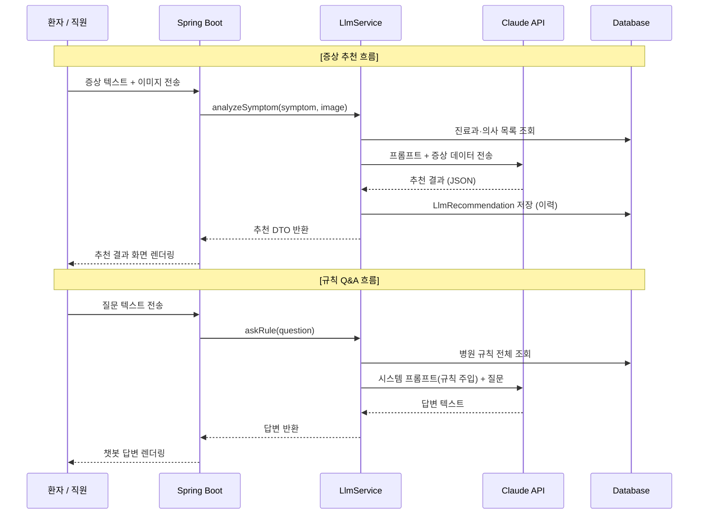

# 🏥 병원 예약 & 내부 업무 시스템 — 프로젝트 계획서 v4

> **문서 버전:** v4.0 (LLM 기능 통합)
**작성일:** 2026년
**개발 기간:** 5주 (기존 4주 + LLM 통합 1주 추가)
**팀 구성:** 책임개발자 1명 + 개발자 3명 + AI 보조
**목표 성공 확률:** 85~90%
**연관 문서:** 프로젝트 계획서 v3.0 / ERD v1.0 / 화면 흐름 시퀀스 다이어그램
> 

---

## 📌 v4.0 변경 요약 (v3.0 → v4.0)

| 항목 | v3.0 | v4.0 |
| --- | --- | --- |
| 개발 기간 | 4주 | **5주** (LLM 통합 1주 추가) |
| 외부 예약 화면 | 진료과·의사 직접 선택 | **증상 입력(텍스트/이미지) → LLM 추천 후 예약** |
| 내부 직원 화면 | 정적 화면만 존재 | **의사·간호사 화면에 병원 규칙 Q&A 챗봇 추가** |
| LLM 연동 | 없음 | **Claude API 2종 연동** |
| 신규 테이블 | 없음 | `LLM_RECOMMENDATION`, `HOSPITAL_RULE` 추가 |

---

## 1. 프로젝트 개요

### 1.1 목표 정의 (SMART 기준)

| 구분 | 목표 |
| --- | --- |
| **S**pecific | v3.0 MVP 전체 + LLM 기반 예약 추천 + 병원 규칙 Q&A 챗봇 2종 기능 추가 |
| **M**easurable | 5주 내 MVP 완료 / LLM 추천 응답 3초 이내 / 챗봇 병원 규칙 관련 질문 정상 응답 |
| **A**chievable | Claude API 활용으로 LLM 직접 구현 없이 연동만으로 완성, 책임개발자가 API 연동 담당 |
| **R**elevant | 환자의 예약 진입 장벽 완화 + 직원 반복 질문 응대 업무 경감 |
| **T**ime-bound | 5주차 말 전체 MVP 배포 완료, LLM 고급 기능은 v1.1로 이관 |

### 1.2 전체 시스템 구조

```
[외부 — 비회원 환자]
  └─ 증상 입력 (텍스트 / 이미지)
       ↓ LLM 분석
  └─ 진료과·의사·시간 추천
       ↓ 환자 확인 후
  └─ 예약 확정

[내부 — 직원 로그인]
  ├─ 접수 관리        (ROLE_STAFF)
  ├─ 진료 관리        (ROLE_DOCTOR)  ← 병원 규칙 Q&A 챗봇
  ├─ 간호 업무        (ROLE_NURSE)   ← 병원 규칙 Q&A 챗봇
  ├─ 인사·물품 관리   (ROLE_ADMIN)
  └─ 병원 규칙 관리   (ROLE_ADMIN)   ← 챗봇 학습 데이터 CRUD
```

---

## 2. LLM 기능 상세 정의

### 2.1 기능 1 — 증상 기반 예약 추천 (외부 환자용)

### 개요 (증상 추천)

환자가 예약 전 자신의 증상을 **텍스트 또는 이미지**로 입력하면, LLM이 분석하여 **적합한 진료과·의사·시간대**를 추천한다. 환자가 추천 결과를 확인하고 예약을 확정하는 방식이다.

### 화면 흐름

```
[증상 입력 화면] /reservation/symptom
┌──────────────────────────────────────────┐
│  증상을 알려주세요                         │
│                                          │
│  텍스트 입력                              │
│  ┌────────────────────────────────────┐  │
│  │ 3일 전부터 오른쪽 아랫배가 아프고  │  │
│  │ 열이 납니다.                       │  │
│  └────────────────────────────────────┘  │
│                                          │
│  이미지 첨부 (선택)                       │
│  [📎 파일 선택]  skin_photo.jpg ✓        │
│                                          │
│         [  AI 추천 받기  ]               │
└──────────────────────────────────────────┘
         ↓ LLM API 호출
┌──────────────────────────────────────────┐
│  🤖 AI 추천 결과                          │
│                                          │
│  증상 요약: 복통·발열 증상으로 보아       │
│  외과 또는 내과 진료가 필요합니다.        │
│                                          │
│  ✅ 추천 진료과  외과                     │
│  ✅ 추천 의사    김철수 전문의             │
│  ✅ 추천 시간    오전 (09:00~12:00)       │
│                                          │
│  ⚠️ AI 추천은 참고용입니다.              │
│     진단은 반드시 의사에게 받으세요.      │
│                                          │
│  [ 이 추천으로 예약하기 ]  [ 직접 선택 ] │
└──────────────────────────────────────────┘
         ↓ 예약하기 선택 시
[기존 예약 폼] — 진료과·의사·시간 자동 입력됨
```

### LLM 호출 설계 (증상 추천)

```
입력 → Claude API
  - 시스템 프롬프트: 병원 진료과 목록 + 추천 기준 지침
  - 사용자 메시지: 증상 텍스트 (+ 이미지 base64, 있는 경우)

출력 ← Claude API (JSON 형식)
  {
    "recommended_department": "외과",
    "recommended_doctor": "김철수",
    "recommended_time": "오전",
    "summary": "복통·발열 증상으로...",
    "disclaimer": "AI 추천은 참고용입니다..."
  }
```

### 시스템 프롬프트 구성 (증상 추천)

```
당신은 병원 예약 도우미입니다.
환자의 증상을 분석하여 아래 진료과 중 가장 적합한 곳을 추천하세요.

[진료과 목록]
- 내과: 소화기, 호흡기, 순환기 관련 질환
- 외과: 수술이 필요한 외상, 복부 질환
- 피부과: 피부 트러블, 발진, 두드러기
- 정형외과: 골절, 관절, 근육 이상
- 이비인후과: 귀·코·목 관련 증상

반드시 JSON 형식으로만 응답하세요.
의학적 진단을 내리지 말고, 진료과 선택을 돕는 수준으로만 안내하세요.
```

### 제약 사항 및 면책 고지

- LLM 추천 결과는 **참고용**임을 화면에 반드시 명시
- **의료 진단이 아님** 고지 문구 필수 출력
- 이미지 분석 시 **개인정보(얼굴 등) 포함 주의** 안내
- API 응답 실패 시 → "직접 선택" 화면으로 자동 전환 (폴백 처리)

---

### 2.2 기능 2 — 병원 규칙 Q&A 챗봇 (내부 직원용)

### 개요 (규칙 Q&A)

의사·간호사가 업무 중 병원 내부 규칙, 처리 절차, 비품 위치 등을 질문하면 LLM이 **병원이 사전에 등록한 규칙 문서를 기반으로** 답변한다. 관리자가 규칙 문서를 직접 관리할 수 있다.

### 화면 위치

```
ROLE_DOCTOR 진료 화면  → 우측 하단 고정 챗봇 버튼 [💬]
ROLE_NURSE  간호 화면  → 우측 하단 고정 챗봇 버튼 [💬]
```

### 챗봇 UI

```
┌─────────────────────────────────┐
│  🏥 병원 도우미           [✕]   │
├─────────────────────────────────┤
│                                 │
│  안녕하세요! 병원 규칙이나      │
│  업무 절차에 대해 질문하세요.   │
│                                 │
│  [직원]  응급 처치 절차가       │
│          어떻게 되나요?         │
│                                 │
│  [AI]    응급 처치 발생 시      │
│          1. 즉시 담당 의사에게  │
│             연락합니다.         │
│          2. 응급 키트는 3층     │
│             간호사 스테이션에   │
│             보관되어 있습니다.  │
│          3. ...                 │
│                                 │
├─────────────────────────────────┤
│  [질문을 입력하세요...]   [전송] │
└─────────────────────────────────┘
```

### LLM 호출 설계 (규칙 Q&A)

```
입력 → Claude API
  - 시스템 프롬프트: DB에 저장된 병원 규칙 전체 텍스트 주입
  - 사용자 메시지: 직원의 질문

출력 ← Claude API
  - 규칙 기반 답변 텍스트
  - 관련 없는 질문 시: "등록된 규칙에서 찾을 수 없습니다" 안내
```

### 시스템 프롬프트 구성 (규칙 Q&A)

```
당신은 [병원명] 소속 내부 직원 전용 업무 도우미입니다.
아래의 병원 규칙 문서를 기반으로만 답변하세요.
규칙 문서에 없는 내용은 "등록된 규칙에서 확인할 수 없습니다"라고 답변하세요.
의료적 판단이나 진단은 하지 마세요.

[병원 규칙 문서]
{hospital_rules_from_db}
```

### 병원 규칙 관리 (ROLE_ADMIN)

```
/admin/rules
┌───────────────────────────────────────┐
│  병원 규칙 관리                        │
├───────────────────────────────────────┤
│  [+ 규칙 추가]                         │
│                                       │
│  ▶ 응급 처치 절차          [수정][삭제]│
│  ▶ 물품 보관 위치 안내     [수정][삭제]│
│  ▶ 당직 근무 규정          [수정][삭제]│
│  ▶ 감염 예방 수칙          [수정][삭제]│
└───────────────────────────────────────┘
```

---

## 3. 시스템 구조 (LLM 통합 반영)

### 3.1 전체 아키텍처

```
[브라우저 - Mustache SSR]
       │
       ▼
[Spring Boot 서버]
  ├─ 기존 Controller / Service / Repository
  └─ LlmService (신규)
       ├─ 증상 분석 API 호출 → Claude API
       └─ 규칙 Q&A API 호출 → Claude API
              │
              ▼
       [Claude API - claude-sonnet-4-6]
              │
              ▼
       [MySQL DB]
         ├─ hospital_rule (규칙 원문 저장)
         └─ llm_recommendation (추천 이력 저장)
```

### 3.2 LLM 연동 흐름 (시퀀스)



---

## 4. 추가 테이블 정의 (v4.0 신규)

### 4.1 HOSPITAL_RULE — 병원 규칙 문서

> 관리자가 등록한 병원 내부 규칙. Q&A 챗봇의 컨텍스트로 사용된다.
> 

| 컬럼명 | 타입 | 제약 | 설명 |
| --- | --- | --- | --- |
| `id` | BIGINT | PK, AUTO_INCREMENT | 규칙 고유 ID |
| `title` | VARCHAR(200) | NOT NULL | 규칙 제목 (예: 응급 처치 절차) |
| `content` | TEXT | NOT NULL | 규칙 본문 텍스트 |
| `category` | VARCHAR(50) | NOT NULL | 카테고리 (EMERGENCY / SUPPLY / DUTY / HYGIENE / OTHER) |
| `is_active` | BOOLEAN | NOT NULL, DEFAULT TRUE | 챗봇 컨텍스트 포함 여부 |
| `created_at` | DATETIME | NOT NULL | 등록 일시 |
| `updated_at` | DATETIME | NOT NULL | 수정 일시 |

### 4.2 LLM_RECOMMENDATION — 증상 추천 이력

> 환자의 증상 분석 요청 및 LLM 추천 결과를 기록한다. 추후 분석 및 개선에 활용한다.
> 

| 컬럼명 | 타입 | 제약 | 설명 |
| --- | --- | --- | --- |
| `id` | BIGINT | PK, AUTO_INCREMENT | 이력 고유 ID |
| `symptom_text` | TEXT | NULL | 환자 입력 증상 텍스트 |
| `has_image` | BOOLEAN | NOT NULL, DEFAULT FALSE | 이미지 첨부 여부 |
| `recommended_dept` | VARCHAR(100) | NULL | 추천 진료과 |
| `recommended_doctor` | VARCHAR(100) | NULL | 추천 의사명 |
| `recommended_time` | VARCHAR(50) | NULL | 추천 시간대 |
| `llm_response_raw` | TEXT | NULL | LLM 응답 원문 (JSON) |
| `is_used` | BOOLEAN | NOT NULL, DEFAULT FALSE | 실제 예약으로 이어졌는지 여부 |
| `created_at` | DATETIME | NOT NULL | 요청 일시 |

---

## 5. 범위 정의 (Scope Definition)

### 5.1 ✅ In-Scope — 전체 MVP 기능 (v4.0)

```
병원 예약 & 내부 업무 시스템 (MVP v4.0)
│
├─ [외부] 예약
│   ├─ 증상 입력 (텍스트 + 이미지 선택)     ← 신규
│   ├─ LLM 진료과·의사·시간 추천            ← 신규
│   ├─ 추천 결과 확인 및 예약 확정
│   ├─ 직접 선택 예약 (기존 방식 유지)
│   ├─ 중복 예약 방지
│   └─ 예약번호 발급
│
├─ [내부] 로그인
│   ├─ ROLE_ADMIN
│   │   ├─ 대시보드, 예약·의사·직원·진료과·물품 CRUD
│   │   └─ 병원 규칙 CRUD                   ← 신규
│   ├─ ROLE_DOCTOR
│   │   ├─ 오늘 진료 목록, 진료 기록 입력
│   │   └─ 병원 규칙 Q&A 챗봇              ← 신규
│   ├─ ROLE_NURSE
│   │   ├─ 오늘 예약 목록, 환자 정보 수정
│   │   └─ 병원 규칙 Q&A 챗봇              ← 신규
│   └─ ROLE_STAFF
│       ├─ 접수 처리, 전화 예약 등록
│       └─ (챗봇 미포함 — v1.1 검토)
```

### 5.2 ❌ Out-Scope (제외)

| 제거 항목 | 이유 | 추후 계획 |
| --- | --- | --- |
| LLM 추천 정확도 피드백 기능 | 개발 범위 초과 | v1.1 |
| 챗봇 대화 이력 저장 | 개인정보 이슈·복잡도 | v1.1 |
| RAG(벡터 DB 검색) | 오버엔지니어링 | v2.0 |
| 다국어 지원 | 범위 초과 | 미정 |
| ROLE_STAFF 챗봇 | 우선순위 조정 | v1.1 |
| LLM Fine-tuning | 인프라 부담 | 미정 |
| 근무 스케줄 / 재고 로그 | v3.0과 동일 | v1.1 |
| SMS / 이메일 알림 | v3.0과 동일 | v1.1 |

---

## 6. 일정 계획 (WBS & Gantt)

### 6.1 WBS (Work Breakdown Structure)

```
1.0 프로젝트 준비 (W1)
  1.1 ERD 설계 (HOSPITAL_RULE, LLM_RECOMMENDATION 추가)
  1.2 Spring Boot 세팅, Git 브랜치 전략
  1.3 공통 레이아웃 및 기본 UI
  1.4 Staff 로그인 / 4 ROLE Security 설정

2.0 외부 예약 시스템 (W2)
  2.1 비회원 예약 폼 & Patient 저장
  2.2 고정 슬롯 기반 시간 선택
  2.3 중복 예약 방지 로직
  2.4 예약번호 발급

3.0 내부 직원 시스템 (W3)
  3.1 접수 처리 화면 (ROLE_STAFF)
  3.2 진료 기록 입력 화면 (ROLE_DOCTOR)
  3.3 간호사 화면 (ROLE_NURSE)
  3.4 관리자 CRUD 전체

4.0 LLM 기능 통합 (W4) ← 신규 주차
  4.1 Claude API 연동 설정 (LlmService 구현)
  4.2 증상 분석 API 연동 (텍스트 + 이미지)
  4.3 추천 결과 화면 및 예약 연동
  4.4 병원 규칙 Q&A 챗봇 UI (Doctor/Nurse 화면)
  4.5 관리자 병원 규칙 CRUD

5.0 마무리 & 배포 (W5)
  5.1 LLM 폴백 처리 (API 실패 시 직접 선택 전환)
  5.2 전체 통합 테스트 (E2E 시나리오)
  5.3 예외 처리 및 유효성 검증
  5.4 UI 정리, 면책 고지 문구 추가
  5.5 보안 점검 (ROLE, CSRF, API Key 보호)
  5.6 Linux 서버 배포
```

### 6.2 Gantt Chart

```
Task                                  | W1 | W2 | W3 | W4 | W5 |
--------------------------------------|----|----|----|----|-----|
ERD 설계 & 프로젝트 세팅               | ██ |    |    |    |     |
공통 레이아웃 & 기본 UI                | ██ |    |    |    |     |
Staff 로그인 / 4 ROLE Security         | ██ |    |    |    |     |
비회원 예약 폼 & 중복 방지             |    | ██ |    |    |     |
슬롯 선택 & 예약번호 발급              |    | ██ |    |    |     |
접수 처리 (ROLE_STAFF)                 |    | ██ |    |    |     |
진료 기록 입력 (ROLE_DOCTOR)           |    |    | ██ |    |     |
간호사 화면 (ROLE_NURSE)               |    |    | ██ |    |     |
관리자 CRUD 전체                       |    |    | ██ |    |     |
Claude API 연동 (LlmService)           |    |    |    | ██ |     |
증상 분석 + 추천 화면                  |    |    |    | ██ |     |
규칙 Q&A 챗봇 UI                      |    |    |    | ██ |     |
병원 규칙 관리 CRUD (관리자)           |    |    |    | ██ |     |
LLM 폴백 처리                         |    |    |    |    | ██  |
통합 테스트 & 예외 처리                |    |    |    |    | ██  |
면책 고지 & UI 정리                    |    |    |    |    | ██  |
보안 점검 & 배포                       |    |    |    |    | ██  |
```

---

## 7. 인력 배치표 (Resource Plan)

### 7.1 역할 및 담당 영역

| 역할 | 인원 | 주요 담당 |
| --- | --- | --- |
| 책임개발자 (Tech Lead) | 1명 | 전체 아키텍처, Security, 예약 핵심 로직, **LlmService 구현 및 Claude API 연동**, 배포 |
| 개발자 A | 1명 | 외부 예약 폼, 증상 입력 화면, 추천 결과 화면 UI |
| 개발자 B | 1명 | 접수 화면, 진료 기록 화면, **챗봇 UI 컴포넌트** |
| 개발자 C | 1명 | 관리자 화면, 물품 CRUD, **병원 규칙 관리 CRUD** |
| AI 보조 | - | 코드 초안, 프롬프트 엔지니어링, 디버깅, UI 템플릿 |

### 7.2 주차별 역할 분배

| 주차 | 책임개발자 | 개발자 A | 개발자 B | 개발자 C |
| --- | --- | --- | --- | --- |
| **W1** | ERD 확정 (신규 테이블 포함), Security, 공통 레이아웃 | 기본 UI 구성 | 직원 로그인 화면 | 관리자 기본 틀 |
| **W2** | 예약 중복 방지, 트랜잭션 처리 | 예약 폼, 슬롯 선택 | 접수 화면 | 예약 취소 기능 |
| **W3** | 관리자 구조, 상태 흐름 검증 | 예약 완료 화면 | 진료 기록·간호사 화면 | 관리자 전체 CRUD |
| **W4** | **LlmService 구현, Claude API 연동, 프롬프트 설계** | **증상 입력·추천 결과 화면 UI** | **챗봇 UI 컴포넌트** | **병원 규칙 CRUD** |
| **W5** | 폴백 처리, 통합 테스트, 보안 점검, 배포 | UI 정리, 면책 고지 문구 | E2E 테스트 | QA 지원, 최종 UI |

---

## 8. 커뮤니케이션 계획

| 구분 | 방식 | 주기 | 목적 |
| --- | --- | --- | --- |
| 데일리 체크인 | Discord / Slack | 매일 오전 | 진행 현황, 블로커 확인 |
| 주간 통합 미팅 | 화상 / 대면 | 매주 금요일 | 산출물 검토, 머지, 다음 주 계획 |
| 이슈 관리 | GitHub Issues | 수시 | 버그·태스크 추적 |
| 코드 리뷰 | GitHub PR | 기능 완료 시 | 품질 관리 (책임개발자 필수 리뷰) |
| 긴급 트러블슈팅 | DM + AI 보조 | 즉시 | 30분 이상 블로킹 즉시 에스컬레이션 |
| **W4 LLM 킥오프** | 화상 | W4 월요일 | LLM 연동 방식 팀 전체 공유, 역할 재확인 |

---

## 9. 형상관리 전략

### 9.1 Git 브랜치 전략

```
main                    → 배포 가능 안정 버전 (Protected)
develop                 → 통합 브랜치
feature/*
  feature/auth
  feature/reservation
  feature/reception
  feature/doctor-treatment
  feature/admin
  feature/inventory
  feature/llm-symptom        ← 신규 (증상 추천)
  feature/llm-chatbot        ← 신규 (규칙 Q&A)
  feature/hospital-rules     ← 신규 (규칙 관리)
hotfix/*
release/v1.0
```

### 9.2 커밋 컨벤션

```
feat:     새로운 기능 추가
fix:      버그 수정
refactor: 코드 리팩토링
docs:     문서 수정
test:     테스트 코드
chore:    빌드·설정 변경
prompt:   LLM 프롬프트 추가/수정   ← 신규 타입

예시)
feat: 증상 입력 폼 및 이미지 첨부 기능 구현
feat: Claude API 연동 LlmService 구현
prompt: 증상 분석 시스템 프롬프트 v1 작성
fix: LLM 응답 JSON 파싱 오류 수정
```

### 9.3 버전 로드맵

| 버전 | 내용 | 목표 시점 |
| --- | --- | --- |
| v0.1 | 인증 (4 ROLE), 공통 레이아웃 | W1 말 |
| v0.5 | 예약 + 접수 흐름 완성 | W2 말 |
| v0.8 | 진료 기록 + 관리자 CRUD 완성 | W3 말 |
| v0.9 | LLM 2종 통합 완성 | W4 말 |
| **v1.0** | **MVP 전체 완성 / 배포** | **W5 말** |

---

## 10. 리스크 관리 계획

| # | 리스크 | 가능성 | 영향도 | 대응 전략 | 담당 |
| --- | --- | --- | --- | --- | --- |
| R1 | 예약 중복 오류 | 중 | 높음 | 트랜잭션 + DB UNIQUE 이중 방어 | 책임개발자 |
| R2 | ROLE 접근 권한 누락 | 중 | 높음 | Security 초기 완성, E2E 테스트 | 책임개발자 |
| R3 | 상태 흐름 오류 | 중 | 높음 | Service 레이어 상태 검증 로직, 역방향 전이 차단 | 책임개발자 |
| R4 | 개발자 블로킹 | 높음 | 높음 | 기능 1개씩 소유, AI 보조 활용, 30분 룰 | 책임개발자 |
| R5 | 일정 지연 | 중 | 높음 | Scope Lock, W4에 LLM만 집중 | 전원 |
| **R6** | **Claude API 응답 지연 / 실패** | **중** | **중** | **폴백 처리 필수: 오류 시 "직접 선택" 화면 전환, 타임아웃 5초 설정** | **책임개발자** |
| **R7** | **LLM 부정확한 추천** | **높음** | **중** | **면책 고지 문구 필수 출력, 참고용임을 명시, 직접 선택 옵션 상시 노출** | **전원** |
| **R8** | **API Key 외부 노출** | **낮음** | **매우높음** | **환경변수(.env) 관리, .gitignore 등록, 서버 측에서만 API 호출** | **책임개발자** |
| R9 | DB 설계 변경 | 낮음 | 중 | W1 내 ERD 완전 확정 | 책임개발자 |
| R10 | 배포 환경 이슈 | 낮음 | 중 | W3부터 테스트 서버 구성 | 책임개발자 |

### LLM 리스크 집중 대응 방안

### API Key 보안 (R8 — 최우선)

```
# application.properties (절대 git 커밋 금지)
claude.api.key=${CLAUDE_API_KEY}

# 서버 환경변수로만 관리
# Claude API 호출은 반드시 서버 사이드(LlmService)에서만 수행
# 브라우저에 API Key 노출 절대 금지
```

### 폴백 처리 (R6)

```
LLM API 호출 실패 시:
  → 사용자에게 "AI 추천 서비스가 일시적으로 불가합니다" 안내
  → "직접 선택하여 예약하기" 버튼 즉시 표시
  → 기존 예약 폼으로 자연스럽게 이동
```

### 면책 고지 (R7)

```
추천 결과 화면에 반드시 포함:
  "⚠️ 이 추천은 AI가 생성한 참고 정보입니다.
   의학적 진단이 아니며, 최종 판단은 의사에게 받으시기 바랍니다."
```

---

## 11. 기술 스택 (v4.0)

| 구분 | 기술 | 비고 |
| --- | --- | --- |
| Backend | Spring Boot (Gradle) |  |
| View | Mustache (SSR) | 챗봇 UI는 Vanilla JS로 비동기 처리 |
| 인증 | 세션 기반 (Spring Security) |  |
| ORM | Spring Data JPA |  |
| Database | MySQL |  |
| **LLM API** | **Claude API (claude-sonnet-4-6)** | **서버 사이드 호출 전용** |
| **HTTP Client** | **Spring RestTemplate 또는 WebClient** | **Claude API 호출용** |
| 보안 | BCrypt, CSRF 방어, ROLE 기반 URL 제어, **API Key 환경변수 관리** |  |
| 버전 관리 | Git (GitHub) |  |
| 배포 | Linux Server |  |
| AI 보조 | Claude / ChatGPT | 개발 보조, 프롬프트 작성 |

---

## 12. MVP 최종 정의

### 12.1 ✅ 1차 구현 필수 (v1.0 — 5주 내)

### 외부 예약 (LLM 포함)

- [x]  증상 텍스트 + 이미지 입력 폼
- [x]  Claude API 연동 진료과·의사·시간 추천
- [x]  추천 결과 화면 (면책 고지 포함)
- [x]  추천 기반 예약 또는 직접 선택 분기
- [x]  중복 예약 방지, 예약번호 발급

### 내부 — LLM 챗봇

- [x]  병원 규칙 Q&A 챗봇 (ROLE_DOCTOR, ROLE_NURSE 화면)
- [x]  관리자 병원 규칙 CRUD

### 내부 — 기존 기능 (v3.0 동일)

- [x]  접수 처리 (ROLE_STAFF)
- [x]  진료 기록 입력·완료 (ROLE_DOCTOR)
- [x]  간호사 화면 (ROLE_NURSE)
- [x]  관리자 전체 CRUD, 대시보드 통계

### 12.2 🔒 2차 확장 (v1.1 이후 — Scope Lock)

- [ ]  LLM 추천 정확도 피드백 수집
- [ ]  챗봇 대화 이력 저장
- [ ]  RAG 기반 벡터 검색 (정확도 향상)
- [ ]  ROLE_STAFF 챗봇 확장
- [ ]  근무 스케줄 / 재고 입출고 로그
- [ ]  SMS / 이메일 알림

---

## 13. 기대 효과

| 분야 | 기대 효과 |
| --- | --- |
| 환자 경험 | 증상 입력만으로 예약 진료과 결정 → 예약 진입 장벽 낮춤 |
| 예약 정확도 | AI 추천으로 잘못된 진료과 예약 감소 |
| 직원 업무 경감 | 반복 질문 응대 대신 챗봇이 병원 규칙 안내 |
| 관리 효율 | 관리자가 규칙 문서 관리만으로 챗봇 업데이트 가능 |
| 팀 역량 | LLM API 실전 연동 경험 획득 |

---

## 📊 버전별 설계 비교 요약

| 항목 | v1.0 (원안) | v2.0 | v3.0 | v4.0 (최종) |
| --- | --- | --- | --- | --- |
| 개발 기간 | 4주 | 4주 | 4주 | **5주** |
| 외부 인증 | 회원 로그인 | 회원 로그인 | 비회원 | 비회원 |
| 예약 방식 | 직접 선택 | 직접 선택 | 직접 선택 | **증상 → LLM 추천** |
| 내부 ROLE | USER/ADMIN | USER/ADMIN | 4종 | 4종 |
| 접수 흐름 | 없음 | 없음 | 3단계 | 3단계 |
| 진료 기록 | 없음 | 없음 | 있음 | 있음 |
| **LLM 기능** | 없음 | 없음 | 없음 | **2종** |
| 복잡도 | 높음 | 중 | 중 | **중상** |
| 예상 성공률 | 60~70% | 85~90% | 85~92% | **85~90%** |

---

> **Scope Lock 선언:***5주 개발 기간 중 신규 기능은 어떠한 경우에도 추가하지 않는다.
Claude API Key는 절대로 Git에 커밋하지 않으며, 환경변수로만 관리한다.
LLM 추천 결과는 참고용임을 항상 명시하고, 의료적 판단으로 오용되지 않도록 한다.*
> 

*문서 변경 이력 및 회의록은 GitHub Wiki에서 관리합니다.*