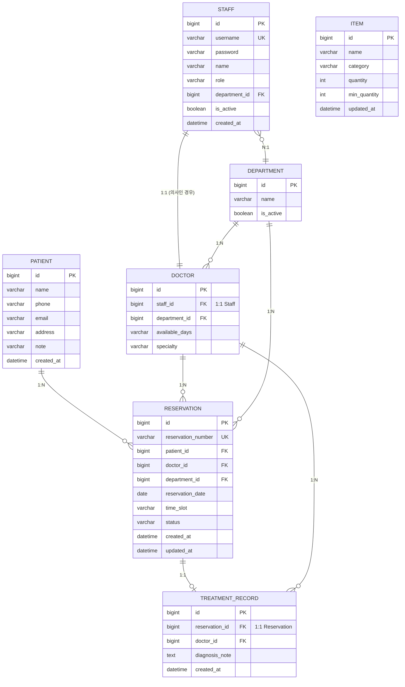
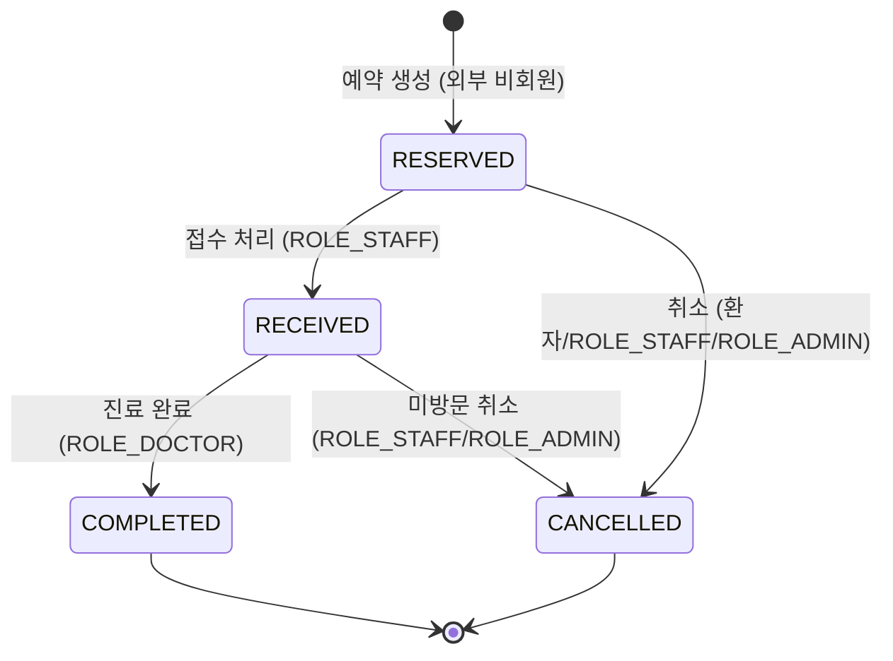

# 🏥 병원 예약 & 내부 업무 시스템 — ERD 문서 v1

> **문서 버전:** v1.0
**작성일:** 2026년
**연관 문서:** 프로젝트 계획서 v3.0 / 화면 흐름 시퀀스 다이어그램
**기준:** 비회원 예약 + 내부 직원 로그인 시스템
> 

---

## 목차

1. [ERD 전체 다이어그램](#1-erd-전체-다이어그램)
2. [테이블 정의서](#2-테이블-정의서)
3. [관계 정의](#3-관계-정의)
4. [상태 코드 정의](#4-상태-코드-정의)
5. [설계 결정 사항 & 주의사항](#5-설계-결정-사항--주의사항)
6. [전체 테이블 요약](#-전체-테이블-요약)

---

## 1. ERD 전체 다이어그램



---

## 2. 테이블 정의서

### 2.1 PATIENT — 비회원 환자

> 외부 예약 시 생성되는 환자 정보 테이블. 회원 인증 없이 이름·연락처만으로 식별한다.
> 

| 컬럼명 | 타입 | 제약 | 설명 |
| --- | --- | --- | --- |
| `id` | BIGINT | PK, AUTO_INCREMENT | 환자 고유 ID |
| `name` | VARCHAR(50) | NOT NULL | 성명 |
| `phone` | VARCHAR(20) | NOT NULL | 연락처 |
| `email` | VARCHAR(100) | NULL | 이메일 (선택 입력) |
| `address` | VARCHAR(255) | NULL | 주소 (접수 시 추가 입력) |
| `note` | VARCHAR(500) | NULL | 특이사항 (접수 시 추가 입력) |
| `created_at` | DATETIME | NOT NULL, DEFAULT NOW() | 최초 예약 생성 시각 |

**설계 포인트**

- `address`, `note`는 외부 예약 시 NULL이며, 접수 처리 단계(`ROLE_STAFF`)에서 업데이트된다.
- 동일 환자가 재방문 시 동명이인 구분이 어려우므로, `phone`을 준식별자로 활용하는 것을 권장한다.

---

### 2.2 DEPARTMENT — 진료과

> 병원 내 진료과 정보. 의사 및 예약의 기준 단위가 된다.
> 

| 컬럼명 | 타입 | 제약 | 설명 |
| --- | --- | --- | --- |
| `id` | BIGINT | PK, AUTO_INCREMENT | 진료과 고유 ID |
| `name` | VARCHAR(100) | NOT NULL, UNIQUE | 진료과명 (예: 내과, 외과) |
| `is_active` | BOOLEAN | NOT NULL, DEFAULT TRUE | 운영 여부 (비활성 시 예약 노출 제외) |

---

### 2.3 STAFF — 내부 직원 (로그인 계정)

> 병원 내부 시스템에 로그인하는 직원 정보. 모든 내부 사용자는 이 테이블로 인증한다.
> 

| 컬럼명 | 타입 | 제약 | 설명 |
| --- | --- | --- | --- |
| `id` | BIGINT | PK, AUTO_INCREMENT | 직원 고유 ID |
| `username` | VARCHAR(50) | NOT NULL, UNIQUE | 로그인 ID |
| `password` | VARCHAR(255) | NOT NULL | BCrypt 암호화 비밀번호 |
| `name` | VARCHAR(50) | NOT NULL | 직원 실명 |
| `role` | VARCHAR(20) | NOT NULL | 권한 (ADMIN / DOCTOR / NURSE / STAFF) |
| `department_id` | BIGINT | FK, NULL | 소속 진료과 |
| `is_active` | BOOLEAN | NOT NULL, DEFAULT TRUE | 재직 여부 |
| `created_at` | DATETIME | NOT NULL, DEFAULT NOW() | 등록 일시 |

**역할(ROLE) 정의**

| role 값 | 설명 | 주요 접근 화면 |
| --- | --- | --- |
| `ADMIN` | 관리자 | 전체 관리 화면 |
| `DOCTOR` | 의사 | 진료 목록·진료 기록 입력 |
| `NURSE` | 간호사 | 예약 목록·환자 정보 수정 |
| `STAFF` | 원무/접수 직원 | 접수 처리·전화 예약 등록 |

---

### 2.4 DOCTOR — 의사 상세 정보

> `STAFF` 테이블과 1:1 관계. 의사 역할을 가진 직원의 진료 관련 부가 정보를 저장한다.
> 

| 컬럼명 | 타입 | 제약 | 설명 |
| --- | --- | --- | --- |
| `id` | BIGINT | PK, AUTO_INCREMENT | 의사 고유 ID |
| `staff_id` | BIGINT | FK, UNIQUE (1:1) | Staff 참조 |
| `department_id` | BIGINT | FK, NOT NULL | 소속 진료과 |
| `available_days` | VARCHAR(20) | NULL | 진료 가능 요일 (예: `MON,WED,FRI`) |
| `specialty` | VARCHAR(100) | NULL | 전문 분야 (예: 소화기내과) |

**설계 포인트**

- `available_days`는 쉼표 구분 문자열로 저장한다. (예: `"MON,TUE,THU"`)
- 외부 예약 화면에서 의사 선택 시, `available_days`와 선택 날짜의 요일을 비교하여 예약 가능 여부를 필터링한다.

---

### 2.5 RESERVATION — 예약

> 외부 환자의 예약 정보. 상태 변화의 중심 테이블이다.
> 

| 컬럼명 | 타입 | 제약 | 설명 |
| --- | --- | --- | --- |
| `id` | BIGINT | PK, AUTO_INCREMENT | 예약 고유 ID |
| `reservation_number` | VARCHAR(20) | NOT NULL, UNIQUE | 예약번호 (예: `RES-20260101-001`) |
| `patient_id` | BIGINT | FK, NOT NULL | 환자 참조 |
| `doctor_id` | BIGINT | FK, NOT NULL | 담당 의사 참조 |
| `department_id` | BIGINT | FK, NOT NULL | 진료과 참조 |
| `reservation_date` | DATE | NOT NULL | 예약 날짜 |
| `time_slot` | VARCHAR(10) | NOT NULL | 예약 시간 슬롯 (예: `09:00`) |
| `status` | VARCHAR(20) | NOT NULL, DEFAULT `RESERVED` | 예약 상태 |
| `created_at` | DATETIME | NOT NULL, DEFAULT NOW() | 예약 생성 일시 |
| `updated_at` | DATETIME | NULL | 마지막 상태 변경 일시 |

**중복 예약 방지 제약**

```sql
-- 동일 의사·날짜·시간에 중복 예약 방지
UNIQUE KEY uq_reservation (doctor_id, reservation_date, time_slot)
```

**예약번호 생성 규칙**

```
RES-{YYYYMMDD}-{당일 순번 3자리}
예시: RES-20260301-001
```

---

### 2.6 TREATMENT_RECORD — 진료 기록

> 의사가 진료 완료 후 작성하는 기록. `RESERVATION`과 1:1 관계이다.
> 

| 컬럼명 | 타입 | 제약 | 설명 |
| --- | --- | --- | --- |
| `id` | BIGINT | PK, AUTO_INCREMENT | 진료 기록 고유 ID |
| `reservation_id` | BIGINT | FK, UNIQUE (1:1) | 예약 참조 |
| `doctor_id` | BIGINT | FK, NOT NULL | 진료한 의사 참조 |
| `diagnosis_note` | TEXT | NULL | 진료 내용 (증상, 처방 등) |
| `created_at` | DATETIME | NOT NULL, DEFAULT NOW() | 진료 기록 작성 시각 |

**설계 포인트**

- `TreatmentRecord` 저장과 `Reservation.status = COMPLETED` 변경은 **하나의 트랜잭션**으로 처리한다.
- `reservation_id`에 UNIQUE 제약을 걸어 하나의 예약에 하나의 진료 기록만 허용한다.

---

### 2.7 ITEM — 물품 (재고)

> 병원 내 물품 및 재고 정보. 단순 수량 관리만 지원한다 (입출고 로그 미포함 — v1.1 확장 예정).
> 

| 컬럼명 | 타입 | 제약 | 설명 |
| --- | --- | --- | --- |
| `id` | BIGINT | PK, AUTO_INCREMENT | 물품 고유 ID |
| `name` | VARCHAR(100) | NOT NULL | 물품명 |
| `category` | VARCHAR(50) | NOT NULL | 카테고리 (의료소모품 / 의료장비 / 일반비품) |
| `quantity` | INT | NOT NULL, DEFAULT 0 | 현재 재고 수량 |
| `min_quantity` | INT | NOT NULL, DEFAULT 0 | 최소 재고 기준 (부족 판단 기준) |
| `updated_at` | DATETIME | NOT NULL | 최근 수량 수정 일시 |

**재고 부족 판단 로직**

```
quantity < min_quantity → 재고 부족 상태
관리자 대시보드 통계: SELECT COUNT(*) FROM item WHERE quantity < min_quantity
```

---

## 3. 관계 정의

### 3.1 관계 목록

| 관계 | 형태 | 설명 |
| --- | --- | --- |
| `PATIENT` → `RESERVATION` | 1:N | 한 환자가 여러 예약을 가질 수 있다 |
| `DOCTOR` → `RESERVATION` | 1:N | 한 의사가 여러 예약을 가질 수 있다 |
| `DEPARTMENT` → `RESERVATION` | 1:N | 한 진료과에 여러 예약이 존재한다 |
| `RESERVATION` → `TREATMENT_RECORD` | 1:1 | 하나의 예약에 하나의 진료 기록 |
| `DOCTOR` → `TREATMENT_RECORD` | 1:N | 한 의사가 여러 진료 기록을 작성 |
| `STAFF` → `DOCTOR` | 1:1 | 의사 역할 직원의 부가 정보 |
| `DEPARTMENT` → `DOCTOR` | 1:N | 한 진료과에 여러 의사 소속 |
| `DEPARTMENT` → `STAFF` | 1:N | 한 진료과에 여러 직원 소속 (선택적) |

### 3.2 외래 키(FK) 목록

| 테이블 | FK 컬럼 | 참조 테이블 | 참조 컬럼 | ON DELETE |
| --- | --- | --- | --- | --- |
| `STAFF` | `department_id` | `DEPARTMENT` | `id` | SET NULL |
| `DOCTOR` | `staff_id` | `STAFF` | `id` | CASCADE |
| `DOCTOR` | `department_id` | `DEPARTMENT` | `id` | RESTRICT |
| `RESERVATION` | `patient_id` | `PATIENT` | `id` | RESTRICT |
| `RESERVATION` | `doctor_id` | `DOCTOR` | `id` | RESTRICT |
| `RESERVATION` | `department_id` | `DEPARTMENT` | `id` | RESTRICT |
| `TREATMENT_RECORD` | `reservation_id` | `RESERVATION` | `id` | CASCADE |
| `TREATMENT_RECORD` | `doctor_id` | `DOCTOR` | `id` | RESTRICT |

---

## 4. 상태 코드 정의

### 4.1 RESERVATION.status 상태 흐름



### 4.2 상태별 상세 정의

| 상태값 | 한국어 | 전환 주체 | 진입 조건 | 가능한 다음 상태 |
| --- | --- | --- | --- | --- |
| `RESERVED` | 예약완료 | 외부 비회원 | 예약 폼 제출 성공 | `RECEIVED`, `CANCELLED` |
| `RECEIVED` | 접수완료 | `ROLE_STAFF` | 이전 상태가 `RESERVED`인 경우만 허용 | `COMPLETED`, `CANCELLED` |
| `COMPLETED` | 진료완료 | `ROLE_DOCTOR` | 이전 상태가 `RECEIVED`인 경우만 허용 | 없음 (최종 상태) |
| `CANCELLED` | 취소 | 환자 / `ROLE_STAFF` / `ROLE_ADMIN` | `COMPLETED` 이전 상태에서만 허용 | 없음 (최종 상태) |

**상태 전이 검증 규칙 (Service 레이어 필수 구현)**

```
RESERVED  → RECEIVED  : 허용 (ROLE_STAFF, ROLE_ADMIN)
RECEIVED  → COMPLETED : 허용 (ROLE_DOCTOR, ROLE_ADMIN)
COMPLETED → 어떤 상태  : 금지 (역방향 전이 불가)
CANCELLED → 어떤 상태  : 금지 (취소 후 복구 불가)
```

### 4.3 STAFF.role 코드 정의

| role 값 | 설명 | 접근 URL 패턴 |
| --- | --- | --- |
| `ADMIN` | 관리자 | `/admin/**` |
| `DOCTOR` | 의사 | `/doctor/**` |
| `NURSE` | 간호사 | `/nurse/**` |
| `STAFF` | 원무/접수 | `/staff/**` |

### 4.4 ITEM.category 코드 정의

| category 값 | 설명 |
| --- | --- |
| `MEDICAL_SUPPLIES` | 의료 소모품 |
| `MEDICAL_EQUIPMENT` | 의료 장비 |
| `GENERAL_SUPPLIES` | 일반 비품 |

---

## 5. 설계 결정 사항 & 주의사항

### 5.1 핵심 설계 결정

**User 테이블 미사용 (비회원 방식 채택)**

외부 환자의 로그인·회원가입 기능을 제거하고 `PATIENT` 테이블로 분리했다. 이를 통해 Spring Security 설정 복잡도를 낮추고, 외부 예약 폼의 개발 난이도를 줄였다. 내부 직원 인증은 `STAFF` 테이블 하나로 통일한다.

**STAFF와 DOCTOR 테이블 분리**

내부 직원 로그인 정보(`STAFF`)와 의사의 진료 관련 부가 정보(`DOCTOR`)를 분리했다. 의사가 아닌 직원(간호사, 원무직)은 `DOCTOR` 레코드를 가지지 않는다. `STAFF.role = 'DOCTOR'`인 경우에만 `DOCTOR` 레코드가 1:1로 존재한다.

**중복 예약 방지 전략**

DB 레벨 UNIQUE 제약 (`doctor_id + reservation_date + time_slot`)과 Service 레이어의 사전 조회 검증을 이중으로 적용한다. DB 제약은 최후 방어선이며, Service 레이어에서 먼저 검증하여 사용자에게 명확한 오류 메시지를 반환한다.

**TreatmentRecord와 Reservation의 트랜잭션 묶음 처리**

진료 완료 시 `TreatmentRecord` 저장과 `Reservation.status = COMPLETED` 변경은 반드시 하나의 트랜잭션 내에서 처리해야 한다. 둘 중 하나라도 실패하면 전체 롤백되어야 한다.

### 5.2 MVP 범위에서 의도적으로 제외한 설계 요소

| 제외 항목 | 이유 | v1.1 계획 |
| --- | --- | --- |
| 재고 입출고 로그 테이블 (`INVENTORY_LOG`) | 동시성 처리 복잡도 | 추가 예정 |
| 예약 변경 이력 테이블 | 상태 변화 추적 오버엔지니어링 | 검토 예정 |
| 환자 방문 이력 집계 뷰 | 초진/재진 구분 로직 복잡 | 검토 예정 |
| 스케줄 타임슬롯 별도 테이블 | 고정 슬롯 문자열 저장으로 대체 | 검토 예정 |
| Soft Delete (deleted_at) | 단순 CRUD 수준 유지 | v1.1 적용 권장 |

### 5.3 인덱스 권장사항

```sql
-- 예약 목록 조회 성능 (당일 예약 조회 빈번)
CREATE INDEX idx_reservation_date ON reservation(reservation_date);
CREATE INDEX idx_reservation_status ON reservation(status);
CREATE INDEX idx_reservation_doctor ON reservation(doctor_id, reservation_date);

-- 직원 로그인 성능
CREATE UNIQUE INDEX idx_staff_username ON staff(username);
```

### 5.4 JPA 엔티티 패키지 구조 (권장)

```
com.hospital.domain
├─ patient
│   └─ Patient.java
├─ staff
│   ├─ Staff.java
│   └─ Doctor.java
├─ department
│   └─ Department.java
├─ reservation
│   ├─ Reservation.java
│   ├─ ReservationStatus.java  (Enum)
│   └─ TreatmentRecord.java
└─ inventory
    ├─ Item.java
    └─ ItemCategory.java       (Enum)
```

---

## 📋 전체 테이블 요약

| 테이블 | 행 수 예상 | 주요 역할 | 비고 |
| --- | --- | --- | --- |
| `PATIENT` | 중간 | 비회원 환자 정보 | 외부 예약 시 생성 |
| `DEPARTMENT` | 소수 | 진료과 목록 | 관리자 CRUD |
| `STAFF` | 소수 | 내부 직원 계정 | 인증 주체 |
| `DOCTOR` | 소수 | 의사 부가 정보 | Staff 1:1 |
| `RESERVATION` | 다수 | 예약 중심 테이블 | 상태 흐름 핵심 |
| `TREATMENT_RECORD` | 다수 | 진료 기록 | Reservation 1:1 |
| `ITEM` | 소수 | 물품·재고 관리 | 단순 수량 관리 |

---

*본 ERD는 프로젝트 계획서 v3.0 및 화면 흐름 시퀀스 다이어그램을 기반으로 작성되었습니다.변경 발생 시 GitHub Wiki에서 버전 이력을 관리합니다.*