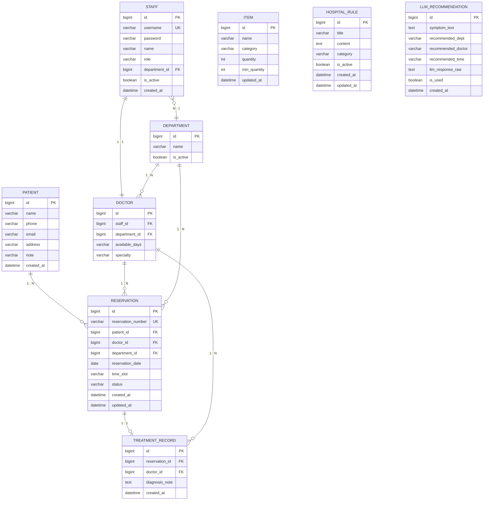
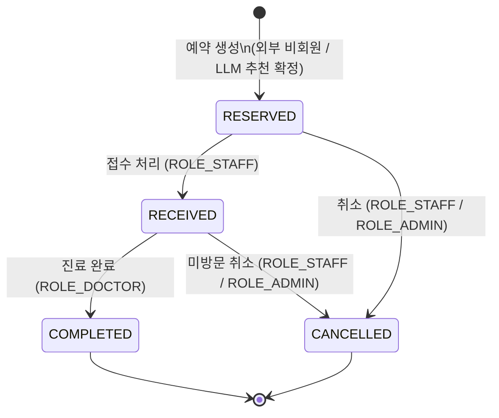

# 🏥 병원 예약 & 내부 업무 시스템 — ERD 문서 v2

> **문서 버전:** v2.0 (v4.1 계획서 기반 재구성)
**작성일:** 2026년
**연관 문서:** 프로젝트 계획서 v4.1 / 화면 흐름 시퀀스 다이어그램
**변경 내역:** HOSPITAL_RULE · LLM_RECOMMENDATION 테이블 추가 / has_image 컬럼 제거
> 

---

## 목차

1. [ERD 전체 다이어그램](#1-erd-전체-다이어그램)
2. [테이블 정의서](#2-테이블-정의서)
3. [관계 정의](#3-관계-정의)
4. [상태 코드 정의](#4-상태-코드-정의)
5. [v1.0 → v2.0 변경 내역](#5-v10--v20-변경-내역)
6. [설계 결정 사항 & 주의사항](#6-설계-결정-사항--주의사항)
7. [전체 테이블 요약](#-전체-테이블-요약)

---

## 1. ERD 전체 다이어그램



---

## 2. 테이블 정의서

### 2.1 PATIENT — 비회원 환자

> 외부 예약 시 생성되는 환자 정보 테이블.
회원 인증 없이 이름·연락처만으로 식별하며, `User` 테이블을 대체한다.
> 

| 컬럼명 | 타입 | 제약 | 설명 |
| --- | --- | --- | --- |
| `id` | BIGINT | PK, AUTO_INCREMENT | 환자 고유 ID |
| `name` | VARCHAR(50) | NOT NULL | 성명 |
| `phone` | VARCHAR(20) | NOT NULL | 연락처 |
| `email` | VARCHAR(100) | NULL | 이메일 (선택 입력) |
| `address` | VARCHAR(255) | NULL | 주소 — 접수 단계(ROLE_STAFF)에서 추가 입력 |
| `note` | VARCHAR(500) | NULL | 특이사항 — 접수 단계에서 추가 입력 |
| `created_at` | DATETIME | NOT NULL, DEFAULT NOW() | 최초 예약 생성 시각 |

**설계 포인트**

- `address`, `note`는 외부 예약 시 NULL. `ROLE_STAFF`의 접수 처리 단계에서 UPDATE된다.
- 동명이인 구분이 어려우므로 `phone`을 준식별자로 활용하는 것을 권장한다.
- LLM 증상 추천 흐름에서 환자가 예약을 확정할 때 이 테이블에 레코드가 생성된다.

---

### 2.2 DEPARTMENT — 진료과

> 병원 내 진료과 정보. 의사 소속, 예약, LLM 추천의 공통 기준 단위.
> 

| 컬럼명 | 타입 | 제약 | 설명 |
| --- | --- | --- | --- |
| `id` | BIGINT | PK, AUTO_INCREMENT | 진료과 고유 ID |
| `name` | VARCHAR(100) | NOT NULL, UNIQUE | 진료과명 (예: 내과, 외과) |
| `is_active` | BOOLEAN | NOT NULL, DEFAULT TRUE | 운영 여부 — FALSE 시 예약 화면에서 노출 제외 |

**설계 포인트**

- LLM 증상 추천 시 시스템 프롬프트에 `is_active = TRUE`인 진료과 목록만 동적으로 주입한다.

---

### 2.3 STAFF — 내부 직원 (로그인 계정)

> 병원 내부 시스템에 로그인하는 모든 직원의 인증 정보.
외부 환자는 이 테이블을 사용하지 않는다.
> 

| 컬럼명 | 타입 | 제약 | 설명 |
| --- | --- | --- | --- |
| `id` | BIGINT | PK, AUTO_INCREMENT | 직원 고유 ID |
| `username` | VARCHAR(50) | NOT NULL, UNIQUE | 로그인 ID |
| `password` | VARCHAR(255) | NOT NULL | BCrypt 암호화 비밀번호 |
| `name` | VARCHAR(50) | NOT NULL | 직원 실명 |
| `role` | VARCHAR(20) | NOT NULL | 권한 — 아래 역할 코드 참조 |
| `department_id` | BIGINT | FK, NULL | 소속 진료과 (간호사·원무는 선택적) |
| `is_active` | BOOLEAN | NOT NULL, DEFAULT TRUE | 재직 여부 |
| `created_at` | DATETIME | NOT NULL, DEFAULT NOW() | 등록 일시 |

**역할(ROLE) 코드**

| role 값 | 설명 | 접근 URL 패턴 | LLM 챗봇 |
| --- | --- | --- | --- |
| `ADMIN` | 관리자 | `/admin/**` | 없음 (규칙 관리) |
| `DOCTOR` | 의사 | `/doctor/**` | **병원 규칙 Q&A 챗봇** |
| `NURSE` | 간호사 | `/nurse/**` | **병원 규칙 Q&A 챗봇** |
| `STAFF` | 원무/접수 | `/staff/**` | 없음 (v1.1 예정) |

---

### 2.4 DOCTOR — 의사 상세 정보

> `STAFF`와 1:1 관계. `role = 'DOCTOR'`인 직원의 진료 관련 부가 정보를 저장한다.
> 

| 컬럼명 | 타입 | 제약 | 설명 |
| --- | --- | --- | --- |
| `id` | BIGINT | PK, AUTO_INCREMENT | 의사 고유 ID |
| `staff_id` | BIGINT | FK, UNIQUE | Staff 참조 — 1:1 제약 |
| `department_id` | BIGINT | FK, NOT NULL | 소속 진료과 |
| `available_days` | VARCHAR(20) | NULL | 진료 가능 요일 (예: `MON,WED,FRI`) |
| `specialty` | VARCHAR(100) | NULL | 전문 분야 (예: 소화기내과) |

**설계 포인트**

- `available_days`는 쉼표 구분 문자열로 저장한다. (예: `"MON,TUE,THU"`)
- 외부 예약 화면에서 날짜 선택 시 해당 요일에 진료 가능한 의사만 필터링하여 표시한다.
- LLM 추천 시 시스템 프롬프트에 의사명과 전문 분야(`specialty`) 목록을 함께 주입한다.

---

### 2.5 RESERVATION — 예약

> 외부 환자의 예약 정보. 시스템 전체 상태 변화의 중심 테이블이다.
> 

| 컬럼명 | 타입 | 제약 | 설명 |
| --- | --- | --- | --- |
| `id` | BIGINT | PK, AUTO_INCREMENT | 예약 고유 ID |
| `reservation_number` | VARCHAR(20) | NOT NULL, UNIQUE | 예약번호 (예: `RES-20260301-001`) |
| `patient_id` | BIGINT | FK, NOT NULL | 환자 참조 |
| `doctor_id` | BIGINT | FK, NOT NULL | 담당 의사 참조 |
| `department_id` | BIGINT | FK, NOT NULL | 진료과 참조 |
| `reservation_date` | DATE | NOT NULL | 예약 날짜 |
| `time_slot` | VARCHAR(10) | NOT NULL | 예약 시간 슬롯 (예: `09:00`) |
| `status` | VARCHAR(20) | NOT NULL, DEFAULT `RESERVED` | 예약 상태 — 코드 정의 참조 |
| `created_at` | DATETIME | NOT NULL, DEFAULT NOW() | 예약 생성 일시 |
| `updated_at` | DATETIME | NULL | 마지막 상태 변경 일시 |

**중복 예약 방지 UNIQUE 제약**

```sql
UNIQUE KEY uq_reservation (doctor_id, reservation_date, time_slot)
-- 동일 의사·날짜·시간 슬롯에 2개 이상의 예약을 DB 레벨에서 차단
```

**예약번호 생성 규칙**

```
형식: RES-{YYYYMMDD}-{당일 순번 3자리}
예시: RES-20260301-001
```

**LLM 추천 연결 흐름**

```
LLM_RECOMMENDATION (추천 이력)
  recommended_dept, recommended_doctor, recommended_time
       ↓ 환자가 "이 추천으로 예약하기" 선택
RESERVATION 생성 시 해당 값이 자동 입력됨
LLM_RECOMMENDATION.is_used = TRUE 로 업데이트
```

---

### 2.6 TREATMENT_RECORD — 진료 기록

> 의사가 진료 완료 후 작성하는 기록. `RESERVATION`과 1:1 관계.
> 

| 컬럼명 | 타입 | 제약 | 설명 |
| --- | --- | --- | --- |
| `id` | BIGINT | PK, AUTO_INCREMENT | 진료 기록 고유 ID |
| `reservation_id` | BIGINT | FK, UNIQUE | 예약 참조 — UNIQUE로 1:1 보장 |
| `doctor_id` | BIGINT | FK, NOT NULL | 진료한 의사 참조 |
| `diagnosis_note` | TEXT | NULL | 진료 내용 (증상, 처방 등) |
| `created_at` | DATETIME | NOT NULL, DEFAULT NOW() | 진료 기록 작성 시각 |

**설계 포인트**

- `TreatmentRecord` 저장과 `Reservation.status = COMPLETED` 변경은 **반드시 하나의 트랜잭션**으로 처리한다.
- `reservation_id`에 UNIQUE 제약 → 하나의 예약에 하나의 진료 기록만 허용.

---

### 2.7 ITEM — 물품 (재고)

> 병원 내 물품 및 재고 정보. 단순 수량 관리만 지원한다. (입출고 로그는 v1.1 확장 예정)
> 

| 컬럼명 | 타입 | 제약 | 설명 |
| --- | --- | --- | --- |
| `id` | BIGINT | PK, AUTO_INCREMENT | 물품 고유 ID |
| `name` | VARCHAR(100) | NOT NULL | 물품명 |
| `category` | VARCHAR(50) | NOT NULL | 카테고리 코드 — 아래 코드 정의 참조 |
| `quantity` | INT | NOT NULL, DEFAULT 0 | 현재 재고 수량 |
| `min_quantity` | INT | NOT NULL, DEFAULT 0 | 최소 재고 기준 (부족 판단 기준) |
| `updated_at` | DATETIME | NOT NULL | 최근 수량 수정 일시 |

**재고 부족 판단 로직**

```sql
-- 관리자 대시보드 통계 쿼리 (단순 count)
SELECT COUNT(*) FROM item WHERE quantity < min_quantity
```

---

### 2.8 HOSPITAL_RULE — 병원 규칙 문서 ★ 신규 (v4.1)

> 관리자(`ROLE_ADMIN`)가 등록·관리하는 병원 내부 규칙 문서.
`ROLE_DOCTOR` · `ROLE_NURSE`의 Q&A 챗봇 시스템 프롬프트 컨텍스트로 사용된다.
> 

| 컬럼명 | 타입 | 제약 | 설명 |
| --- | --- | --- | --- |
| `id` | BIGINT | PK, AUTO_INCREMENT | 규칙 고유 ID |
| `title` | VARCHAR(200) | NOT NULL | 규칙 제목 (예: 응급 처치 절차) |
| `content` | TEXT | NOT NULL | 규칙 본문 텍스트 |
| `category` | VARCHAR(50) | NOT NULL | 카테고리 코드 — 아래 코드 정의 참조 |
| `is_active` | BOOLEAN | NOT NULL, DEFAULT TRUE | 챗봇 컨텍스트 포함 여부 — FALSE 시 프롬프트에서 제외 |
| `created_at` | DATETIME | NOT NULL, DEFAULT NOW() | 등록 일시 |
| `updated_at` | DATETIME | NOT NULL | 수정 일시 |

**챗봇 프롬프트 주입 방식**

```sql
-- LlmService에서 챗봇 호출 시 아래 쿼리로 규칙 전체를 조회하여 시스템 프롬프트에 주입
SELECT title, content FROM hospital_rule WHERE is_active = TRUE ORDER BY category
```

**카테고리 코드 (HOSPITAL_RULE.category)**

| 값 | 설명 |
| --- | --- |
| `EMERGENCY` | 응급 처치 관련 규칙 |
| `SUPPLY` | 물품·비품 보관 위치 |
| `DUTY` | 당직·근무 관련 규정 |
| `HYGIENE` | 감염 예방·위생 수칙 |
| `OTHER` | 기타 규칙 |

---

### 2.9 LLM_RECOMMENDATION — 증상 추천 이력 ★ 신규 (v4.1)

> 환자의 증상 분석 요청과 LLM 추천 결과를 기록하는 이력 테이블.
실제 예약으로 이어졌는지 추적하여 추후 추천 품질 개선에 활용한다.
**이미지 관련 컬럼 없음** — v4.1에서 텍스트 전용으로 확정.
> 

| 컬럼명 | 타입 | 제약 | 설명 |
| --- | --- | --- | --- |
| `id` | BIGINT | PK, AUTO_INCREMENT | 추천 이력 고유 ID |
| `symptom_text` | TEXT | NOT NULL | 환자 입력 증상 텍스트 |
| `recommended_dept` | VARCHAR(100) | NULL | LLM 추천 진료과명 |
| `recommended_doctor` | VARCHAR(100) | NULL | LLM 추천 의사명 |
| `recommended_time` | VARCHAR(50) | NULL | LLM 추천 시간대 (예: 오전) |
| `llm_response_raw` | TEXT | NULL | LLM 응답 원문 JSON (디버깅·분석용) |
| `is_used` | BOOLEAN | NOT NULL, DEFAULT FALSE | 이 추천으로 실제 예약이 생성되었는지 여부 |
| `created_at` | DATETIME | NOT NULL, DEFAULT NOW() | 추천 요청 일시 |

**설계 포인트**

- `has_image` 컬럼 없음 — v4.1에서 이미지 입력 기능 제외로 불필요.
- `is_used`는 환자가 "이 추천으로 예약하기"를 선택하여 `RESERVATION`이 생성될 때 `TRUE`로 UPDATE된다.
- `llm_response_raw`는 원문 JSON을 그대로 저장하여 LLM 응답 파싱 오류 발생 시 디버깅에 활용한다.
- **외래 키 미설정** — 비회원 예약 특성상 `PATIENT`와 연결하지 않는다. 추천 → 예약 전환 추적은 `is_used` 플래그로만 관리한다.

---

## 3. 관계 정의

### 3.1 관계 목록

| 관계 | 형태 | 설명 |
| --- | --- | --- |
| `PATIENT` → `RESERVATION` | 1:N | 한 환자가 여러 예약을 가질 수 있다 |
| `DOCTOR` → `RESERVATION` | 1:N | 한 의사가 여러 예약을 담당한다 |
| `DEPARTMENT` → `RESERVATION` | 1:N | 한 진료과에 여러 예약이 존재한다 |
| `RESERVATION` → `TREATMENT_RECORD` | 1:1 | 하나의 예약에 하나의 진료 기록 |
| `DOCTOR` → `TREATMENT_RECORD` | 1:N | 한 의사가 여러 진료 기록을 작성한다 |
| `STAFF` → `DOCTOR` | 1:1 | 의사 역할 직원의 진료 부가 정보 |
| `DEPARTMENT` → `DOCTOR` | 1:N | 한 진료과에 여러 의사 소속 |
| `DEPARTMENT` → `STAFF` | 1:N | 한 진료과에 여러 직원 소속 |
| `HOSPITAL_RULE` | 독립 | 다른 테이블과 FK 없음. 챗봇 컨텍스트 전용 |
| `LLM_RECOMMENDATION` | 독립 | 다른 테이블과 FK 없음. 추천 이력 전용 |

### 3.2 외래 키(FK) 목록

| 테이블 | FK 컬럼 | 참조 테이블 | 참조 컬럼 | ON DELETE |
| --- | --- | --- | --- | --- |
| `STAFF` | `department_id` | `DEPARTMENT` | `id` | SET NULL |
| `DOCTOR` | `staff_id` | `STAFF` | `id` | CASCADE |
| `DOCTOR` | `department_id` | `DEPARTMENT` | `id` | RESTRICT |
| `RESERVATION` | `patient_id` | `PATIENT` | `id` | RESTRICT |
| `RESERVATION` | `doctor_id` | `DOCTOR` | `id` | RESTRICT |
| `RESERVATION` | `department_id` | `DEPARTMENT` | `id` | RESTRICT |
| `TREATMENT_RECORD` | `reservation_id` | `RESERVATION` | `id` | CASCADE |
| `TREATMENT_RECORD` | `doctor_id` | `DOCTOR` | `id` | RESTRICT |

---

## 4. 상태 코드 정의

### 4.1 RESERVATION.status 상태 흐름



### 4.2 상태별 상세 정의

| 상태값 | 한국어 | 전환 주체 | 진입 조건 | 가능한 다음 상태 |
| --- | --- | --- | --- | --- |
| `RESERVED` | 예약완료 | 외부 비회원 (직접 / LLM 추천) | 예약 폼 제출 성공 | `RECEIVED`, `CANCELLED` |
| `RECEIVED` | 접수완료 | `ROLE_STAFF` | 이전 상태가 `RESERVED`인 경우만 허용 | `COMPLETED`, `CANCELLED` |
| `COMPLETED` | 진료완료 | `ROLE_DOCTOR` | 이전 상태가 `RECEIVED`인 경우만 허용 | 없음 (최종 상태) |
| `CANCELLED` | 취소 | `ROLE_STAFF` / `ROLE_ADMIN` | `COMPLETED` 이전 상태에서만 허용 | 없음 (최종 상태) |

**상태 전이 검증 규칙 (Service 레이어 필수 구현)**

```
RESERVED  → RECEIVED  : 허용 — ROLE_STAFF, ROLE_ADMIN
RECEIVED  → COMPLETED : 허용 — ROLE_DOCTOR, ROLE_ADMIN
COMPLETED → 어떤 상태  : 금지 — 역방향 전이 불가
CANCELLED → 어떤 상태  : 금지 — 취소 후 복구 불가
```

### 4.3 STAFF.role 코드

| 값 | 설명 | 접근 URL | LLM 기능 |
| --- | --- | --- | --- |
| `ADMIN` | 관리자 | `/admin/**` | 병원 규칙 CRUD |
| `DOCTOR` | 의사 | `/doctor/**` | 규칙 Q&A 챗봇 사용 |
| `NURSE` | 간호사 | `/nurse/**` | 규칙 Q&A 챗봇 사용 |
| `STAFF` | 원무/접수 | `/staff/**` | 없음 (v1.1 예정) |

### 4.4 ITEM.category 코드

| 값 | 설명 |
| --- | --- |
| `MEDICAL_SUPPLIES` | 의료 소모품 |
| `MEDICAL_EQUIPMENT` | 의료 장비 |
| `GENERAL_SUPPLIES` | 일반 비품 |

### 4.5 HOSPITAL_RULE.category 코드

| 값 | 설명 |
| --- | --- |
| `EMERGENCY` | 응급 처치 규칙 |
| `SUPPLY` | 물품·비품 보관 위치 |
| `DUTY` | 당직·근무 규정 |
| `HYGIENE` | 감염 예방·위생 수칙 |
| `OTHER` | 기타 |

---

## 5. v1.0 → v2.0 변경 내역

| 항목 | ERD v1.0 | ERD v2.0 (v4.1 기반) | 변경 이유 |
| --- | --- | --- | --- |
| 테이블 수 | 7개 | **9개** | HOSPITAL_RULE, LLM_RECOMMENDATION 추가 |
| LLM 관련 | 없음 | **2개 테이블 추가** | v4.1 LLM 기능 반영 |
| `has_image` 컬럼 | 없음 (v1.0에서도 없음) | **명시적 제외** | v4.1에서 이미지 입력 기능 제거 확정 |
| DOCTOR.available_days | 있음 | 있음 (유지) | LLM 프롬프트 주입 시 활용 명시 |
| DEPARTMENT.is_active | 있음 | 있음 (유지) | LLM 프롬프트 동적 주입 시 필터 조건 명시 |
| LLM_RECOMMENDATION FK | — | **없음 (독립 테이블)** | 비회원 특성상 PATIENT 연결 불필요 |
| HOSPITAL_RULE FK | — | **없음 (독립 테이블)** | 순수 텍스트 컨텍스트 테이블 |

---

## 6. 설계 결정 사항 & 주의사항

### 6.1 핵심 설계 결정 5가지

**① User 테이블 미사용 — PATIENT + STAFF 분리**

외부 환자는 `PATIENT`, 내부 직원은 `STAFF`로 완전히 분리한다. 두 테이블은 서로 FK 관계가 없다. Spring Security는 `STAFF` 테이블만 인증 대상으로 처리하여 설정 복잡도를 최소화한다.

**② STAFF와 DOCTOR 분리 설계**

직원 로그인 정보(`STAFF`)와 의사 진료 부가 정보(`DOCTOR`)를 분리하여 간호사·원무 직원이 불필요한 의사 컬럼을 갖지 않도록 한다. `role = 'DOCTOR'`인 직원만 `DOCTOR` 레코드를 1:1로 보유한다.

**③ 중복 예약 방지 — DB 레벨 + Service 레벨 이중 방어**

- Service 레이어에서 사전 조회 후 명확한 오류 메시지 반환 (사용자 경험)
- DB UNIQUE 제약 `(doctor_id, reservation_date, time_slot)`으로 최후 방어 (데이터 정합성)

**④ HOSPITAL_RULE과 LLM_RECOMMENDATION 독립 설계**

두 테이블은 다른 테이블과 FK 관계를 갖지 않는다.

- `HOSPITAL_RULE`: 순수 텍스트 데이터. `LlmService`에서 조회 후 프롬프트에 문자열로 주입.
- `LLM_RECOMMENDATION`: 비회원 추천 이력. `PATIENT`와 연결하지 않는 이유는 추천 시점에 아직 `PATIENT`가 생성되기 전이기 때문.

**⑤ TreatmentRecord + Reservation 트랜잭션 묶음 처리**

```java
// 반드시 @Transactional 내에서 두 작업 처리
treatmentRecordRepository.save(record);
reservation.updateStatus(ReservationStatus.COMPLETED);
// 둘 중 하나 실패 시 전체 롤백
```

### 6.2 LLM 연동 시 DB 활용 흐름 정리

```
[증상 추천 흐름]
1. DEPARTMENT: is_active=TRUE 목록 조회 → 프롬프트 주입
2. DOCTOR: specialty, available_days 조회 → 프롬프트 주입
3. Claude API 호출 → JSON 응답 수신
4. LLM_RECOMMENDATION: 추천 이력 저장
5. 환자가 예약 확정 → PATIENT, RESERVATION 생성
6. LLM_RECOMMENDATION.is_used = TRUE 업데이트

[규칙 Q&A 챗봇 흐름]
1. HOSPITAL_RULE: is_active=TRUE 전체 조회 → 시스템 프롬프트 주입
2. Claude API 호출 → 자연어 답변 수신
3. 직원 화면에 답변 렌더링 (저장 없음)
```

### 6.3 MVP 범위에서 의도적으로 제외한 설계 요소

| 제외 항목 | 이유 | v1.1 계획 |
| --- | --- | --- |
| `has_image` 컬럼 | 이미지 입력 기능 v4.1 제외 결정 | 추가 예정 |
| 재고 입출고 로그 테이블 | 동시성 처리 복잡도 | 추가 예정 |
| 챗봇 대화 이력 테이블 | 개인정보 이슈·복잡도 | 검토 예정 |
| LLM 추천 피드백 테이블 | 범위 초과 | 검토 예정 |
| Soft Delete (`deleted_at`) | 단순 CRUD 수준 유지 | 적용 권장 |
| 환자 방문 이력 집계 뷰 | 초진/재진 구분 로직 복잡 | 검토 예정 |

### 6.4 인덱스 권장사항

```sql
-- 예약 조회 성능 (당일 예약 조회 빈번)
CREATE INDEX idx_reservation_date   ON reservation(reservation_date);
CREATE INDEX idx_reservation_status ON reservation(status);
CREATE INDEX idx_reservation_doctor ON reservation(doctor_id, reservation_date);

-- 직원 로그인 성능
CREATE UNIQUE INDEX idx_staff_username ON staff(username);

-- 규칙 챗봇 조회 성능
CREATE INDEX idx_rule_active ON hospital_rule(is_active);

-- LLM 추천 이력 분석용
CREATE INDEX idx_llm_used ON llm_recommendation(is_used);
CREATE INDEX idx_llm_created ON llm_recommendation(created_at);
```

### 6.5 JPA 엔티티 패키지 구조 (권장)

```
com.hospital.domain
├─ patient
│   └─ Patient.java
├─ staff
│   ├─ Staff.java
│   ├─ StaffRole.java            (Enum: ADMIN, DOCTOR, NURSE, STAFF)
│   └─ Doctor.java
├─ department
│   └─ Department.java
├─ reservation
│   ├─ Reservation.java
│   ├─ ReservationStatus.java    (Enum: RESERVED, RECEIVED, COMPLETED, CANCELLED)
│   └─ TreatmentRecord.java
├─ inventory
│   ├─ Item.java
│   └─ ItemCategory.java         (Enum: MEDICAL_SUPPLIES, MEDICAL_EQUIPMENT, GENERAL_SUPPLIES)
└─ llm
    ├─ HospitalRule.java
    ├─ HospitalRuleCategory.java  (Enum: EMERGENCY, SUPPLY, DUTY, HYGIENE, OTHER)
    └─ LlmRecommendation.java
```

---

## 📋 전체 테이블 요약

| 테이블 | 레코드 규모 | 주요 역할 | FK 관계 | LLM 연관 |
| --- | --- | --- | --- | --- |
| `PATIENT` | 중간 | 비회원 환자 정보 | RESERVATION | 추천 확정 시 생성 |
| `DEPARTMENT` | 소수 | 진료과 목록 | STAFF, DOCTOR, RESERVATION | 프롬프트 주입 소스 |
| `STAFF` | 소수 | 내부 직원 계정·인증 | DEPARTMENT | 없음 |
| `DOCTOR` | 소수 | 의사 진료 부가 정보 | STAFF, DEPARTMENT | 프롬프트 주입 소스 |
| `RESERVATION` | 다수 | 예약 중심·상태 흐름 | PATIENT, DOCTOR, DEPARTMENT | 추천 연결 대상 |
| `TREATMENT_RECORD` | 다수 | 진료 기록 | RESERVATION, DOCTOR | 없음 |
| `ITEM` | 소수 | 물품·재고 관리 | 없음 | 없음 |
| `HOSPITAL_RULE` | 소수 | 병원 규칙 문서 | **없음 (독립)** | **챗봇 컨텍스트** |
| `LLM_RECOMMENDATION` | 다수 | 증상 추천 이력 | **없음 (독립)** | **추천 이력 저장** |

---

*본 ERD는 프로젝트 계획서 v4.1 및 화면 흐름 시퀀스 다이어그램을 기반으로 작성되었습니다.변경 발생 시 GitHub Wiki에서 버전 이력을 관리합니다.*