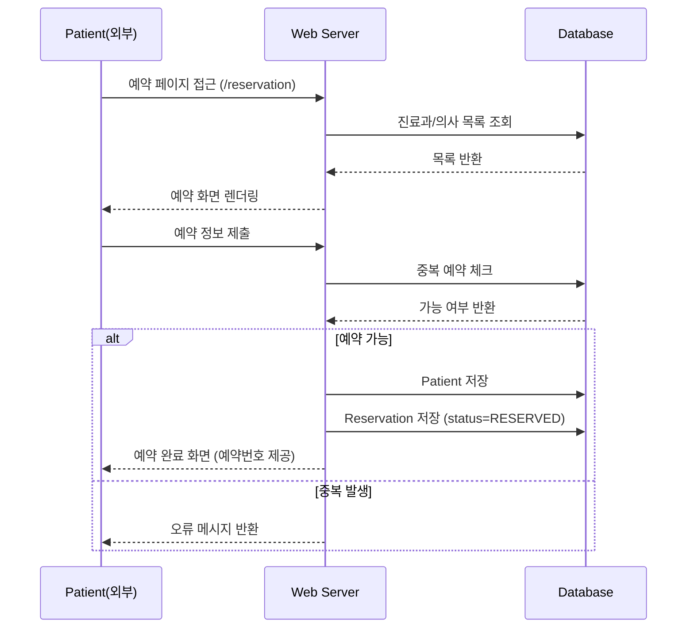
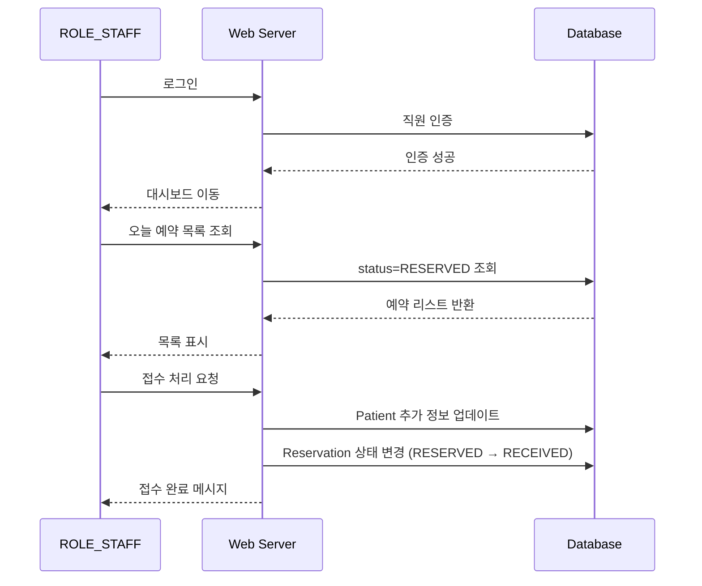
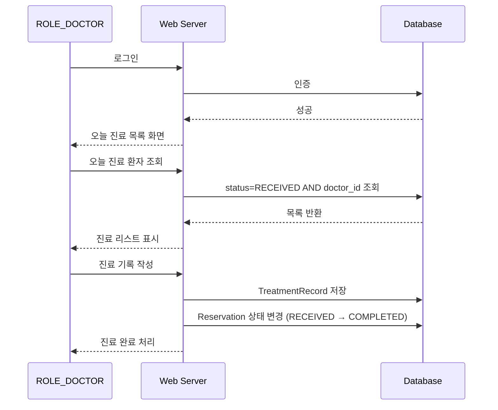
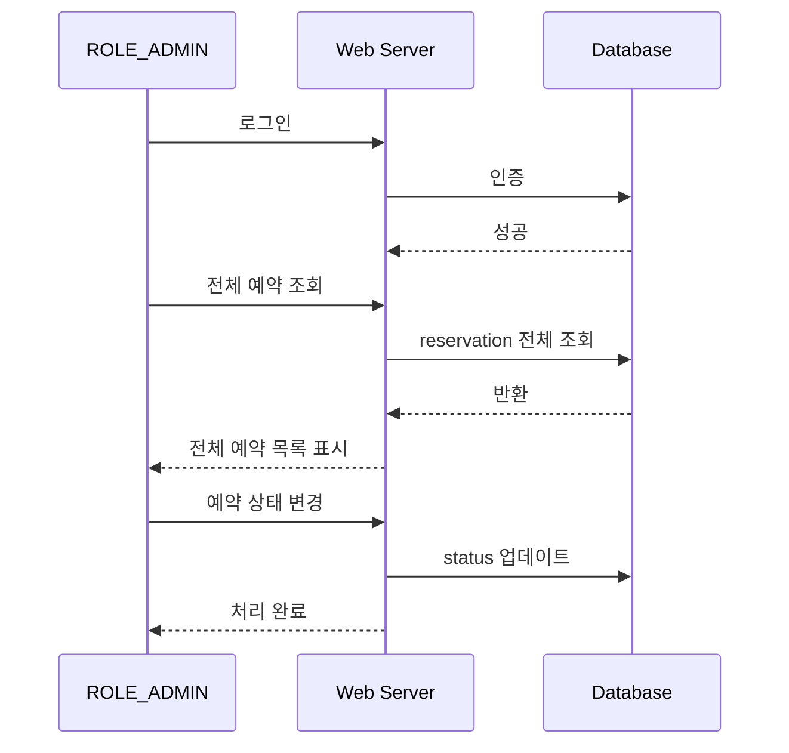
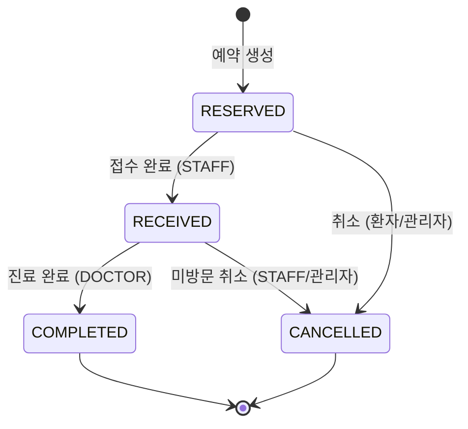

# 🏥 병원 예약 & 내부 업무 시스템 — 화면 흐름 시퀀스 다이어그램 v1

> 실제 개발 시점에서 중요한 상태 변화 중심으로 정리한 역할별 흐름 문서
> 

---

## 목차

1. [외부 사용자 — 예약 흐름](#1-외부-사용자--예약-흐름)
2. [접수 직원 — 접수 처리 흐름](#2-접수-직원--접수-처리-흐름)
3. [의사 — 진료 처리 흐름](#3-의사--진료-처리-흐름)
4. [관리자 — 예약 관리 흐름](#4-관리자--예약-관리-흐름)
5. [전체 상태 흐름 다이어그램](#5-전체-상태-흐름-다이어그램)
6. [권한 기반 화면 흐름 요약](#6-권한-기반-화면-흐름-요약)
7. [설계 시 고려 사항](#-설계-시-고려-사항)

---

## 1. 외부 사용자 — 예약 흐름

### 🎯 목적

비회원 환자가 예약을 생성

### 📌 주요 상태 변화

| 단계 | 상태 |
| --- | --- |
| 예약 정보 제출 후 저장 | `RESERVED` 생성 |
| 중복 예약 시 | 오류 반환, 저장 없음 |

### 🔄 시퀀스 다이어그램



### 📝 흐름 설명

1. **예약 화면 진입** : 환자가 `/reservation` 에 접근하면 서버는 DB에서 진료과·의사 목록을 조회하여 화면을 렌더링합니다.
2. **예약 정보 제출** : 환자가 희망 날짜·진료과·의사를 선택 후 제출합니다.
3. **중복 체크** : 동일 날짜·시간대 예약 여부를 DB에서 검증합니다.
4. **분기 처리**
    - 예약 가능 → `Patient` 및 `Reservation(status=RESERVED)` 를 저장하고 예약번호를 반환합니다.
    - 중복 발생 → 저장 없이 오류 메시지를 반환합니다.

---

## 2. 접수 직원 — 접수 처리 흐름

### 🎯 목적

예약된 환자를 실제 방문 접수 처리

### 📌 주요 상태 변화

| 단계 | 이전 상태 | 이후 상태 |
| --- | --- | --- |
| 접수 처리 | `RESERVED` | `RECEIVED` |

### 🔄 시퀀스 다이어그램



### 📝 흐름 설명

1. **로그인** : `ROLE_STAFF` 권한으로 인증 후 대시보드로 진입합니다.
2. **예약 목록 조회** : `status=RESERVED` 조건으로 당일 예약 환자 목록을 불러옵니다.
3. **접수 처리** : 환자 방문 확인 후 추가 정보(생년월일, 연락처 등)를 업데이트하고 예약 상태를 `RECEIVED` 로 변경합니다.

---

## 3. 의사 — 진료 처리 흐름

### 🎯 목적

접수 완료된 환자를 진료 후 완료 처리

### 📌 주요 상태 변화

| 단계 | 이전 상태 | 이후 상태 |
| --- | --- | --- |
| 진료 완료 | `RECEIVED` | `COMPLETED` |

### 🔄 시퀀스 다이어그램



### 📝 흐름 설명

1. **로그인** : `ROLE_DOCTOR` 권한으로 인증 후 당일 진료 목록 화면으로 진입합니다.
2. **진료 목록 조회** : `status=RECEIVED AND doctor_id=본인` 조건으로 본인 담당 환자만 조회합니다.
3. **진료 기록 작성** : 진단 내용, 처방 등을 `TreatmentRecord` 테이블에 저장합니다.
4. **완료 처리** : 예약 상태를 `COMPLETED` 로 변경하여 진료를 마감합니다.

---

## 4. 관리자 — 예약 관리 흐름

### 🎯 목적

전체 예약 현황 조회 및 상태 일괄 관리

### 📌 주요 상태 변화

| 단계 | 설명 |
| --- | --- |
| 상태 변경 | 관리자 권한으로 임의 상태 업데이트 가능 |

### 🔄 시퀀스 다이어그램



### 📝 흐름 설명

1. **로그인** : `ROLE_ADMIN` 권한으로 인증 후 관리자 대시보드에 진입합니다.
2. **전체 예약 조회** : 날짜·상태·담당 의사 필터 없이 전체 예약 데이터를 조회합니다.
3. **상태 변경** : 취소 처리, 상태 수동 조정 등 관리자 권한의 예약 상태 업데이트를 수행합니다.

---

## 5. 전체 상태 흐름 다이어그램

### 🎯 목적

예약 생성부터 완료/취소까지 전체 생명주기를 한눈에 파악

### 🔄 상태 다이어그램



### 📝 상태 정의

| 상태 | 설명 | 담당 주체 |
| --- | --- | --- |
| `RESERVED` | 예약 완료, 방문 전 | 외부 사용자 |
| `RECEIVED` | 내원 접수 완료 | `ROLE_STAFF` |
| `COMPLETED` | 진료 완료 | `ROLE_DOCTOR` |
| `CANCELLED` | 예약 취소 | 환자 / `ROLE_STAFF` / `ROLE_ADMIN` |

---

## 6. 권한 기반 화면 흐름 요약

### 🗺️ 역할별 화면 진입 경로

```
외부 (비회원 환자)
└── 예약 페이지 (/reservation)
    └── 예약 완료 화면 (예약번호 출력)

ROLE_STAFF (접수 직원)
└── 로그인
    └── 대시보드
        └── 오늘 예약 목록
            └── 접수 처리 → RESERVED → RECEIVED

ROLE_DOCTOR (의사)
└── 로그인
    └── 오늘 진료 목록
        └── 진료 기록 작성
            └── 진료 완료 → RECEIVED → COMPLETED

ROLE_ADMIN (관리자)
└── 로그인
    └── 대시보드
        ├── 예약 관리 (전체 조회·상태 변경)
        ├── 직원 관리
        └── 물품 관리
```

### 📊 권한별 접근 가능 기능 매트릭스

| 기능 | 외부(비회원) | STAFF | DOCTOR | ADMIN |
| --- | --- | --- | --- | --- |
| 예약 생성 | ✅ | ✅ | ✅ | ✅ |
| 예약 목록 조회 (전체) | ❌ | ❌ | ❌ | ✅ |
| 예약 목록 조회 (당일) | ❌ | ✅ | ✅ | ✅ |
| 접수 처리 (RESERVED→RECEIVED) | ❌ | ✅ | ❌ | ✅ |
| 진료 기록 작성 (RECEIVED→COMPLETED) | ❌ | ❌ | ✅ | ✅ |
| 예약 취소 / 상태 수동 변경 | ❌ | ⚠️ 부분 | ❌ | ✅ |
| 직원 관리 | ❌ | ❌ | ❌ | ✅ |
| 물품 관리 | ❌ | ❌ | ❌ | ✅ |

> ⚠️ STAFF의 취소 권한은 미방문 케이스에 한해 제한적으로 부여
> 

---

## 📌 설계 시 고려 사항

**상태 전이 규칙** : 상태는 반드시 정해진 순서(`RESERVED → RECEIVED → COMPLETED`)로만 진행하며, 역방향 전이는 허용하지 않습니다. 취소는 `COMPLETED` 이전 상태에서만 가능합니다.

**권한 체크 위치** : 상태 변경 API는 서버 측에서 반드시 `ROLE` 검증 후 처리하며, 화면 단의 버튼 숨김만으로 권한을 대체하지 않습니다.

**중복 예약 방지** : 동일 `doctor_id` + `reservation_date` + `time_slot` 조합에 대해 DB 유니크 제약 또는 트랜잭션 락을 적용합니다.