# 🏥 병원 예약 & 내부 업무 시스템 — 화면 흐름 시퀀스 다이어그램 v2

> **문서 버전:** v2.0 (v4.1 계획서 기반)
**작성일:** 2026년
**연관 문서:** 프로젝트 계획서 v4.1 / ERD v2.0
**기준:** 비회원 예약 + LLM 증상 추천 + 내부 직원 로그인 + 규칙 Q&A 챗봇
> 

---

## 목차

1. [외부 사용자 — LLM 증상 추천 예약 흐름](#1-외부-사용자--llm-증상-추천-예약-흐름)
2. [외부 사용자 — 직접 선택 예약 흐름](#2-외부-사용자--직접-선택-예약-흐름)
3. [접수 직원 — 접수 처리 흐름](#3-접수-직원--접수-처리-흐름-role_staff)
4. [의사 — 진료 처리 흐름](#4-의사--진료-처리-흐름-role_doctor)
5. [간호사 — 업무 조회 흐름](#5-간호사--업무-조회-흐름-role_nurse)
6. [의사·간호사 — 병원 규칙 Q&A 챗봇 흐름](#6-의사간호사--병원-규칙-qa-챗봇-흐름)
7. [관리자 — 예약 관리 흐름](#7-관리자--예약-관리-흐름-role_admin)
8. [관리자 — 병원 규칙 관리 흐름](#8-관리자--병원-규칙-관리-흐름-role_admin)
9. [관리자 — 인사·물품 관리 흐름](#9-관리자--인사물품-관리-흐름-role_admin)
10. [전체 상태 흐름 다이어그램](#10-전체-상태-흐름-다이어그램)
11. [권한 기반 화면 흐름 요약](#11-권한-기반-화면-흐름-요약)
12. [LLM 연동 흐름 상세](#12-llm-연동-흐름-상세)
13. [설계 시 주요 고려 사항](#-설계-시-주요-고려-사항)

---

## 1. 외부 사용자 — LLM 증상 추천 예약 흐름

### 🎯 목적

비회원 환자가 증상 텍스트를 입력하면 LLM이 진료과·의사·시간을 추천하고, 환자가 확인 후 예약을 확정한다.

### 📌 주요 상태 변화

| 단계 | 상태 |
| --- | --- |
| 예약 확정 시 | `RESERVED` 생성 |
| 중복 예약 시 | 오류 반환, 저장 없음 |
| LLM API 실패 시 | 직접 선택 화면으로 폴백 |

### 🔄 시퀀스 다이어그램

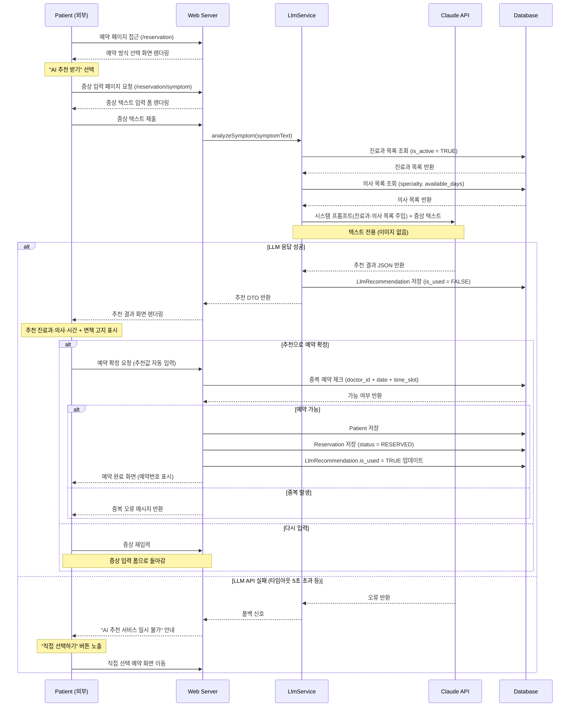

### 📝 흐름 설명

1. **예약 방식 선택** : `/reservation` 진입 시 "AI 추천 받기"와 "직접 선택하기" 두 가지 경로를 제공한다.
2. **증상 입력** : 텍스트 전용 입력 폼. 이미지 첨부 없음(v4.1 확정).
3. **LLM 호출** : `LlmService`가 DB에서 진료과·의사 목록을 먼저 조회한 뒤 Claude API에 프롬프트로 주입하여 현재 운영 중인 진료과·의사 기반의 추천을 받는다.
4. **추천 결과 표시** : 추천 진료과·의사·시간과 함께 면책 고지 문구를 반드시 표시한다.
5. **예약 확정** : 추천값이 자동 입력된 예약 폼에서 최종 확정. 중복 체크 후 저장.
6. **폴백 처리** : API 실패 시 직접 선택 화면으로 자연스럽게 전환. 예약 흐름이 끊기지 않는다.

---

## 2. 외부 사용자 — 직접 선택 예약 흐름

### 🎯 목적

LLM 추천 없이 환자가 진료과·의사·시간을 직접 선택하여 예약한다. AI 추천 흐름의 폴백 경로이기도 하다.

### 📌 주요 상태 변화

| 단계 | 상태 |
| --- | --- |
| 예약 정보 제출 후 저장 | `RESERVED` 생성 |
| 중복 예약 시 | 오류 반환, 저장 없음 |

### 🔄 시퀀스 다이어그램

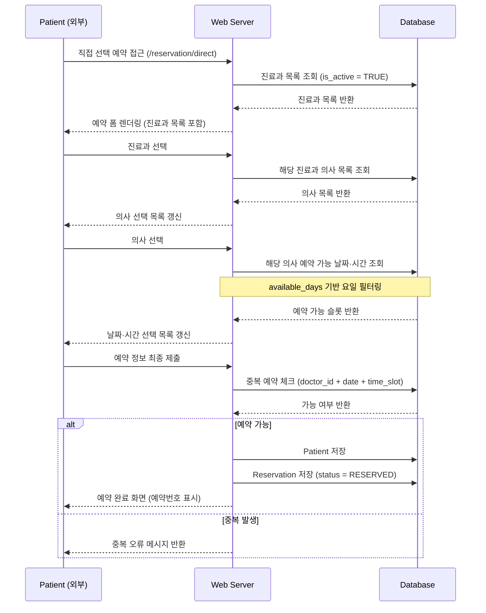

### 📝 흐름 설명

1. **진료과 선택** : `is_active = TRUE`인 진료과 목록만 표시.
2. **의사 선택** : 선택한 진료과에 소속된 의사 목록 조회. `available_days` 기반으로 선택 날짜 요일 필터링.
3. **시간 선택** : 고정 30분 슬롯 중 이미 예약된 슬롯 제외 후 선택 가능 슬롯 표시.
4. **최종 제출 및 저장** : 중복 체크 후 `Patient`, `Reservation` 순서로 저장. 예약번호 발급.

---

## 3. 접수 직원 — 접수 처리 흐름 (ROLE_STAFF)

### 🎯 목적

예약된 환자가 실제 방문하면 접수 처리하여 상태를 `RECEIVED`로 변경하고, 추가 정보를 입력한다.

### 📌 주요 상태 변화

| 이전 상태 | 이후 상태 | 처리 주체 |
| --- | --- | --- |
| `RESERVED` | `RECEIVED` | `ROLE_STAFF` |

### 🔄 시퀀스 다이어그램

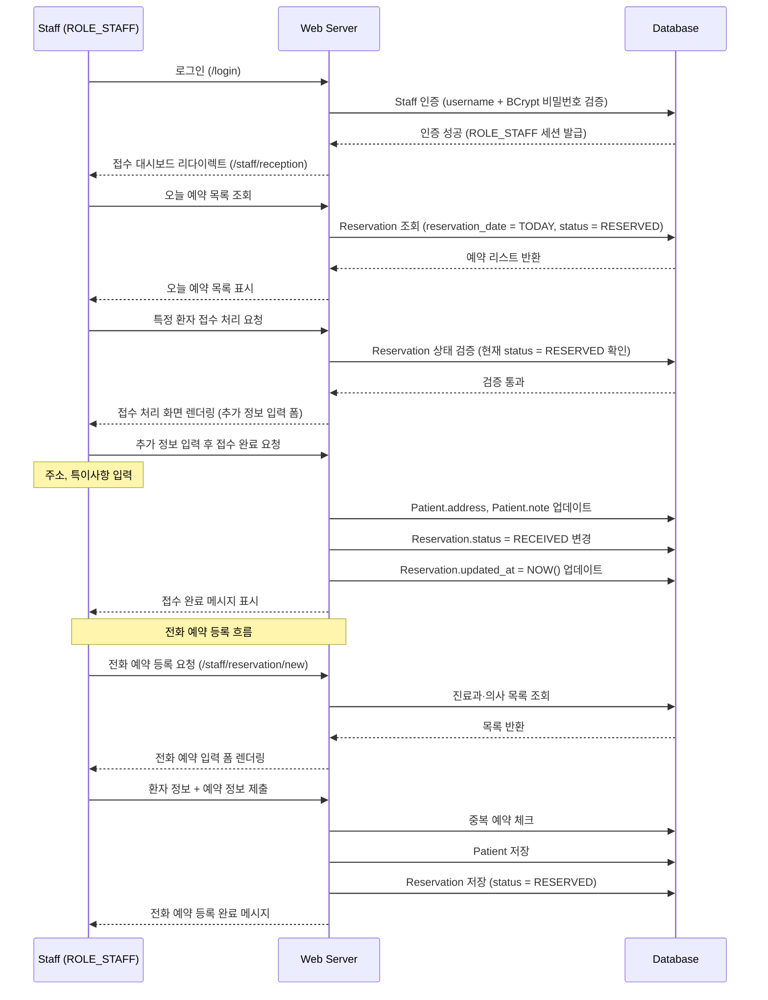

### 📝 흐름 설명

1. **로그인** : `ROLE_STAFF` 세션 인증. 다른 ROLE 경로(`/doctor/**`, `/admin/**`) 접근 불가.
2. **예약 목록 조회** : 당일 `RESERVED` 상태 예약만 필터링하여 표시. 이미 접수된 환자는 목록에서 구분 표시.
3. **접수 처리** : 환자 방문 확인 후 주소·특이사항 추가 입력 → `RECEIVED` 상태로 변경.
4. **전화 예약 등록** : `ROLE_STAFF`는 창구 접수 시 직접 예약을 등록할 수 있다. 흐름은 외부 직접 선택 예약과 동일.

---

## 4. 의사 — 진료 처리 흐름 (ROLE_DOCTOR)

### 🎯 목적

접수 완료된 환자를 진료하고 기록을 작성하여 진료를 완료 처리한다.

### 📌 주요 상태 변화

| 이전 상태 | 이후 상태 | 처리 주체 |
| --- | --- | --- |
| `RECEIVED` | `COMPLETED` | `ROLE_DOCTOR` |

### 🔄 시퀀스 다이어그램

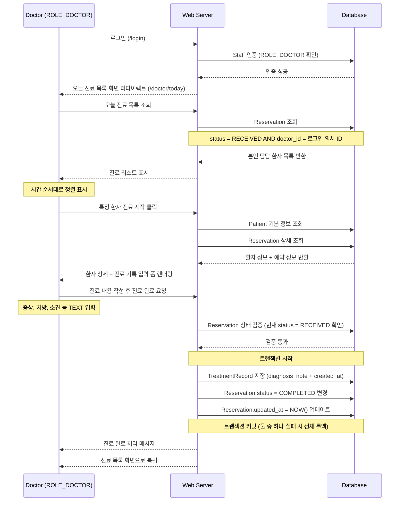

### 📝 흐름 설명

1. **로그인** : `ROLE_DOCTOR` 세션. 로그인 의사의 `doctor_id`로 본인 담당 환자만 조회.
2. **진료 목록** : `status = RECEIVED AND doctor_id = 본인` 조건으로 필터링. 다른 의사 환자 노출 없음.
3. **환자 상세 조회** : 환자 기본 정보(이름·연락처·특이사항) + 예약 정보 함께 표시.
4. **진료 완료 처리** : `TreatmentRecord` 저장과 `Reservation.status = COMPLETED` 변경을 반드시 하나의 트랜잭션으로 처리. 실패 시 전체 롤백.

---

## 5. 간호사 — 업무 조회 흐름 (ROLE_NURSE)

### 🎯 목적

당일 예약 현황과 접수 상태를 확인하고, 필요 시 환자 기본 정보를 수정한다.

### 📌 주요 상태 변화

> 간호사는 상태 변경 권한 없음. 조회 및 환자 정보 수정만 가능.
> 

### 🔄 시퀀스 다이어그램

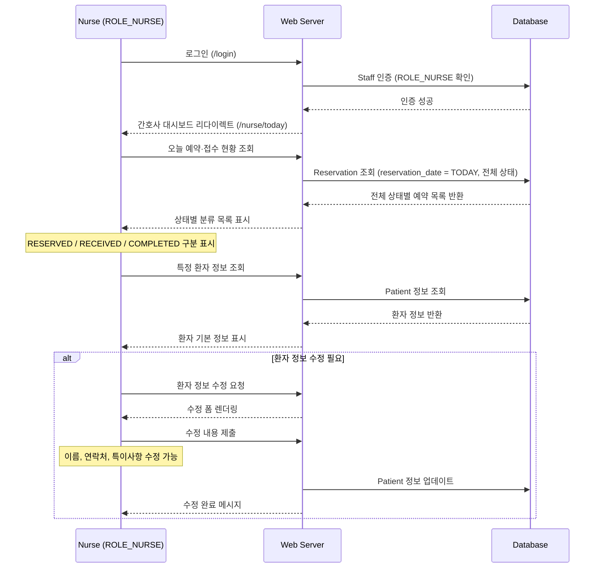

### 📝 흐름 설명

1. **로그인** : `ROLE_NURSE` 세션. 접수 처리(`/staff/**`) 및 관리자 경로(`/admin/**`) 접근 불가.
2. **현황 조회** : 당일 전체 상태별(RESERVED / RECEIVED / COMPLETED) 예약 목록을 한눈에 파악.
3. **환자 정보 수정** : 이름·연락처·특이사항 수정 가능. 예약 상태 변경 권한은 없음.

---

## 6. 의사·간호사 — 병원 규칙 Q&A 챗봇 흐름

### 🎯 목적

`ROLE_DOCTOR` · `ROLE_NURSE`가 업무 화면에서 병원 규칙, 처리 절차, 물품 위치 등을 질문하면 LLM이 등록된 규칙 문서 기반으로 답변한다.

### 📌 LLM 동작 방식

- 관리자가 등록한 `HOSPITAL_RULE` 테이블의 텍스트를 시스템 프롬프트에 주입
- 등록된 규칙 범위 내에서만 답변 / 범위 외 질문은 "확인 불가" 응답
- 대화 이력 저장 없음 (v1.1 예정)

### 🔄 시퀀스 다이어그램

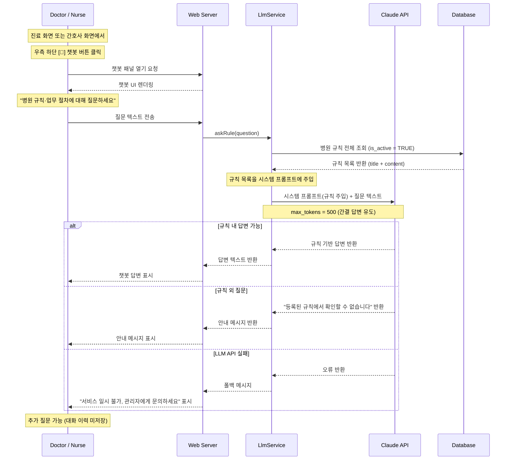

### 📝 흐름 설명

1. **챗봇 진입** : 화면 우측 하단 고정 [💬] 버튼. 업무 화면을 벗어나지 않고 사용.
2. **규칙 주입** : `LlmService`가 매 요청마다 `is_active = TRUE`인 규칙을 DB에서 조회하여 시스템 프롬프트에 주입. 관리자가 규칙을 수정하면 즉시 반영됨.
3. **범위 제한** : 등록된 규칙 외 질문은 LLM이 스스로 거부 응답. 의료적 판단이나 환자 정보 관련 답변 금지.
4. **대화 이력** : 이번 MVP에서는 저장하지 않음. 페이지 새로고침 시 초기화.

---

## 7. 관리자 — 예약 관리 흐름 (ROLE_ADMIN)

### 🎯 목적

전체 예약 현황을 조회하고 상태를 관리(취소, 강제 완료 등)한다.

### 📌 주요 상태 변화

| 단계 | 설명 |
| --- | --- |
| 상태 변경 | 관리자 권한으로 모든 상태 업데이트 가능 |
| 예약 취소 | `COMPLETED` 제외 모든 상태에서 취소 가능 |

### 🔄 시퀀스 다이어그램

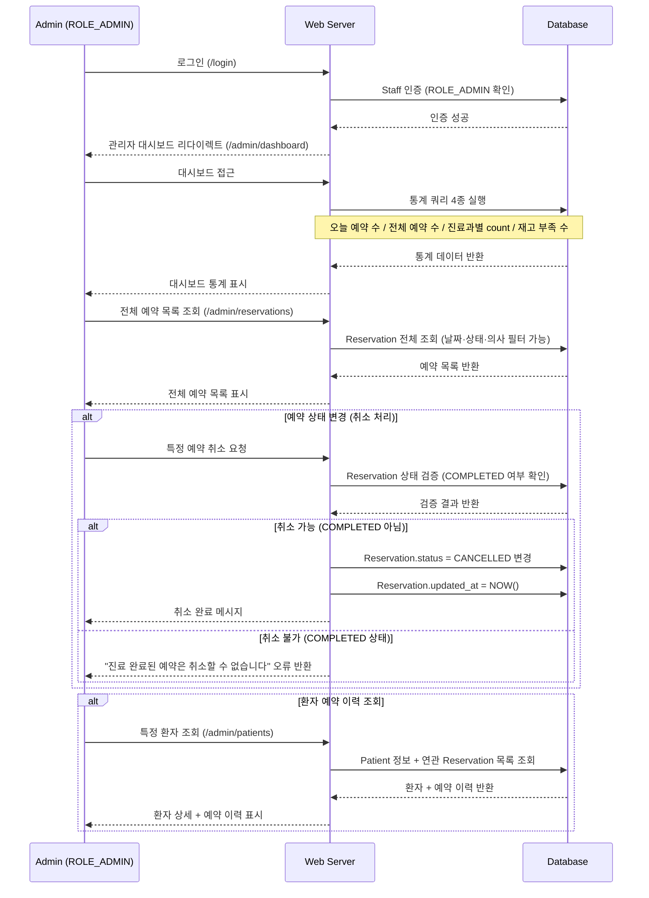

### 📝 흐름 설명

1. **대시보드** : 로그인 즉시 단순 count 통계 4종 표시. 복잡한 집계 쿼리 없음.
2. **전체 예약 조회** : 날짜·상태·담당 의사 기준 필터링 가능. `ROLE_STAFF`와 달리 전 기간 조회 가능.
3. **상태 변경** : 관리자는 `COMPLETED` 이전 모든 상태를 `CANCELLED`로 변경 가능. `COMPLETED` 취소는 시스템 레벨에서 차단.

---

## 8. 관리자 — 병원 규칙 관리 흐름 (ROLE_ADMIN)

### 🎯 목적

챗봇이 참조하는 병원 규칙 문서를 등록·수정·삭제한다. 변경 즉시 챗봇에 반영된다.

### 🔄 시퀀스 다이어그램

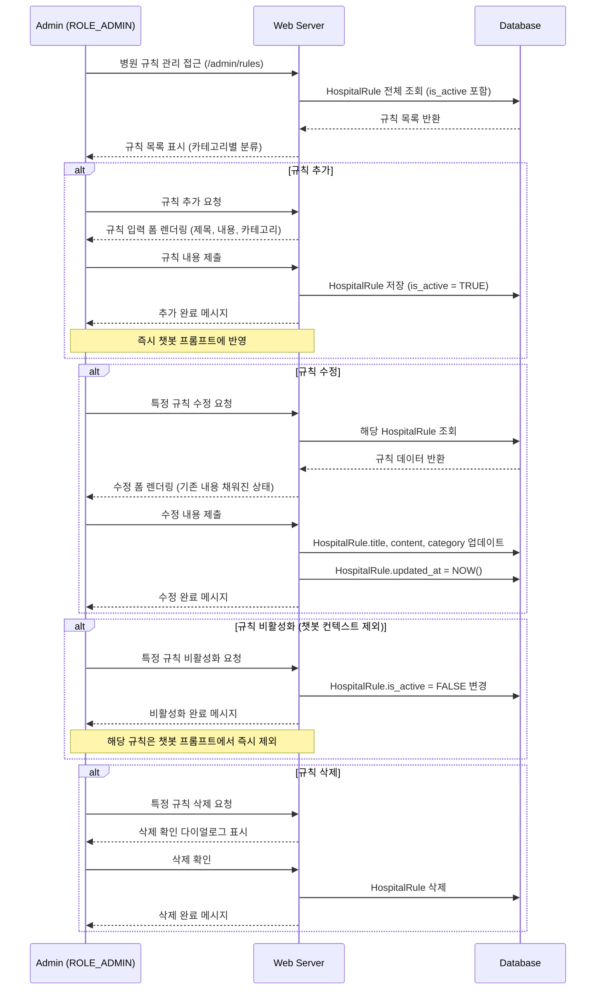

### 📝 흐름 설명

1. **즉시 반영** : `HospitalRule` 수정·추가 후 다음 챗봇 요청부터 바로 반영됨. 별도 배포 불필요.
2. **비활성화** : `is_active = FALSE`로 설정하면 삭제 없이 챗봇에서만 숨길 수 있음. 규칙 데이터는 보존.
3. **카테고리 관리** : EMERGENCY / SUPPLY / DUTY / HYGIENE / OTHER로 분류하여 관리 편의성 제공.

---

## 9. 관리자 — 인사·물품 관리 흐름 (ROLE_ADMIN)

### 🎯 목적

직원·의사 등록 및 물품 재고를 관리한다.

### 🔄 시퀀스 다이어그램

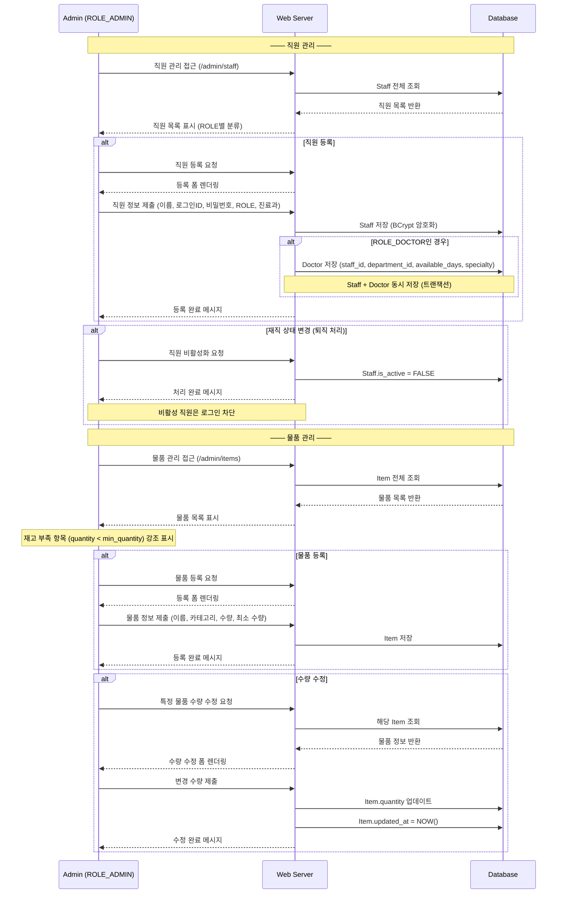

### 📝 흐름 설명

1. **직원 등록** : `ROLE_DOCTOR`인 경우 `Staff` + `Doctor` 레코드를 동일 트랜잭션으로 동시 저장.
2. **퇴직 처리** : 삭제 대신 `is_active = FALSE`로 비활성화. 기존 예약 이력 데이터 보존.
3. **물품 수량 수정** : 입출고 로그 없이 직접 수량 수정 (단순 관리). 재고 부족 항목은 목록에서 강조 표시.

---

## 10. 전체 상태 흐름 다이어그램

### 🎯 목적

예약 생성부터 완료/취소까지 전체 생명주기와 각 전환의 담당 주체를 한눈에 파악한다.

### 🔄 상태 다이어그램

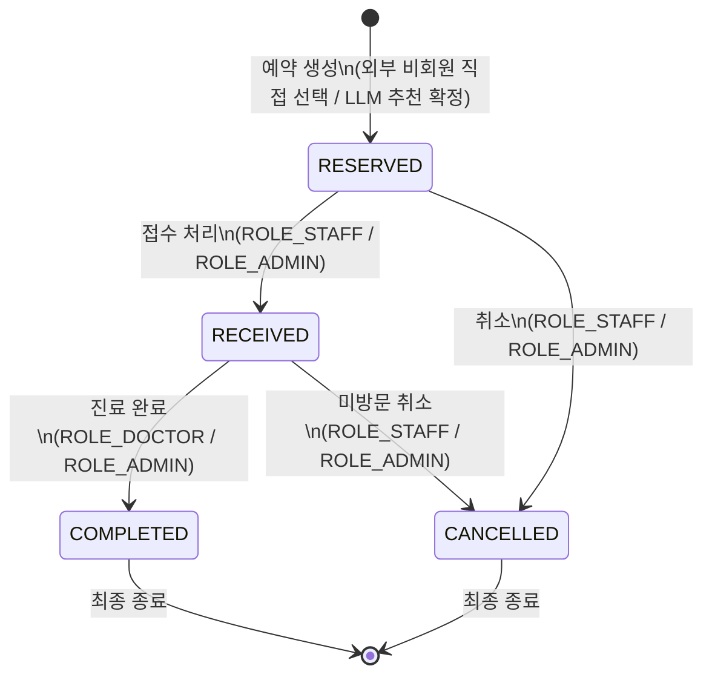

### 📝 상태별 전환 규칙

| 현재 상태 | 다음 상태 | 전환 주체 | 역방향 가능 여부 |
| --- | --- | --- | --- |
| `RESERVED` | `RECEIVED` | `ROLE_STAFF`, `ROLE_ADMIN` | ❌ 불가 |
| `RESERVED` | `CANCELLED` | `ROLE_STAFF`, `ROLE_ADMIN` | ❌ 불가 |
| `RECEIVED` | `COMPLETED` | `ROLE_DOCTOR`, `ROLE_ADMIN` | ❌ 불가 |
| `RECEIVED` | `CANCELLED` | `ROLE_STAFF`, `ROLE_ADMIN` | ❌ 불가 |
| `COMPLETED` | 없음 | — | ❌ 최종 상태 |
| `CANCELLED` | 없음 | — | ❌ 최종 상태 |

> ⚠️ **Service 레이어 검증 필수:** 상태 전이는 화면 버튼 제어만으로 막지 않고, 반드시 Service 레이어에서 이전 상태를 검증 후 변경한다. 잘못된 상태에서 변경 시도 시 명확한 예외 메시지를 반환한다.
> 

---

## 11. 권한 기반 화면 흐름 요약

### 🗺️ 역할별 전체 화면 진입 경로

```
[외부 — 비회원 환자]
└── /reservation                     예약 방식 선택
    ├── /reservation/symptom          증상 텍스트 입력 → LLM 추천
    │   └── 추천 결과 확인
    │       └── /reservation/confirm  예약 확정 → 예약완료 (RESERVED)
    └── /reservation/direct           직접 선택
        └── /reservation/confirm      예약 확정 → 예약완료 (RESERVED)

[ROLE_STAFF — 원무/접수 직원]
└── /login
    └── /staff/reception              오늘 예약 목록
        └── 접수 처리 화면            RESERVED → RECEIVED
    └── /staff/reservation/new        전화 예약 등록

[ROLE_DOCTOR — 의사]
└── /login
    └── /doctor/today                 오늘 진료 목록 (본인 담당)
        └── 진료 기록 입력 화면       RECEIVED → COMPLETED
    └── [💬] 챗봇 버튼               병원 규칙 Q&A

[ROLE_NURSE — 간호사]
└── /login
    └── /nurse/today                  오늘 예약·접수 현황 조회
        └── 환자 정보 수정 화면       Patient 정보 업데이트
    └── [💬] 챗봇 버튼               병원 규칙 Q&A

[ROLE_ADMIN — 관리자]
└── /login
    └── /admin/dashboard              통계 대시보드
    └── /admin/reservations           전체 예약 조회·취소
    └── /admin/patients               환자 목록·예약 이력
    └── /admin/staff                  직원·의사 CRUD
    └── /admin/departments            진료과 CRUD
    └── /admin/items                  물품 재고 관리
    └── /admin/rules                  병원 규칙 CRUD (챗봇 데이터)
```

### 📊 권한별 기능 접근 매트릭스

| 기능 | 외부(비회원) | STAFF | DOCTOR | NURSE | ADMIN |
| --- | --- | --- | --- | --- | --- |
| LLM 증상 추천 예약 | ✅ | ❌ | ❌ | ❌ | ❌ |
| 직접 선택 예약 | ✅ | ✅ | ❌ | ❌ | ✅ |
| 오늘 예약 목록 (전체) | ❌ | ✅ | ❌ | ✅ | ✅ |
| 오늘 예약 목록 (본인) | ❌ | ❌ | ✅ | ❌ | ❌ |
| 전체 예약 조회 (전 기간) | ❌ | ❌ | ❌ | ❌ | ✅ |
| 접수 처리 (RESERVED→RECEIVED) | ❌ | ✅ | ❌ | ❌ | ✅ |
| 진료 기록 입력 (RECEIVED→COMPLETED) | ❌ | ❌ | ✅ | ❌ | ✅ |
| 예약 취소 | ❌ | ⚠️ 당일만 | ❌ | ❌ | ✅ |
| 환자 정보 수정 | ❌ | ✅ | ❌ | ✅ | ✅ |
| **병원 규칙 Q&A 챗봇** | ❌ | ❌ | ✅ | ✅ | ❌ |
| **병원 규칙 CRUD** | ❌ | ❌ | ❌ | ❌ | ✅ |
| 직원·의사 CRUD | ❌ | ❌ | ❌ | ❌ | ✅ |
| 진료과 CRUD | ❌ | ❌ | ❌ | ❌ | ✅ |
| 물품 CRUD | ❌ | ❌ | ❌ | ❌ | ✅ |
| 통계 대시보드 | ❌ | ❌ | ❌ | ❌ | ✅ |

> ⚠️ `ROLE_STAFF`의 예약 취소는 당일 미방문 케이스에 한해 제한적으로 부여
> 

---

## 12. LLM 연동 흐름 상세

### 12.1 증상 추천 vs 규칙 Q&A 비교

| 항목 | 증상 추천 (기능 1) | 규칙 Q&A (기능 2) |
| --- | --- | --- |
| 사용 대상 | 외부 비회원 환자 | ROLE_DOCTOR, ROLE_NURSE |
| 입력 방식 | 증상 텍스트 | 질문 텍스트 |
| 이미지 지원 | ❌ 텍스트 전용 | ❌ 텍스트 전용 |
| 프롬프트 소스 | DB: DEPARTMENT, DOCTOR | DB: HOSPITAL_RULE |
| 응답 형식 | JSON (파싱 후 화면 렌더링) | 자연어 텍스트 |
| 이력 저장 | ✅ LLM_RECOMMENDATION | ❌ 저장 없음 |
| 폴백 처리 | 직접 선택 화면 전환 | "서비스 불가" 안내 |
| 면책 고지 | ✅ 화면 필수 표시 | 규칙 범위 안내 |

### 12.2 LlmService 공통 흐름

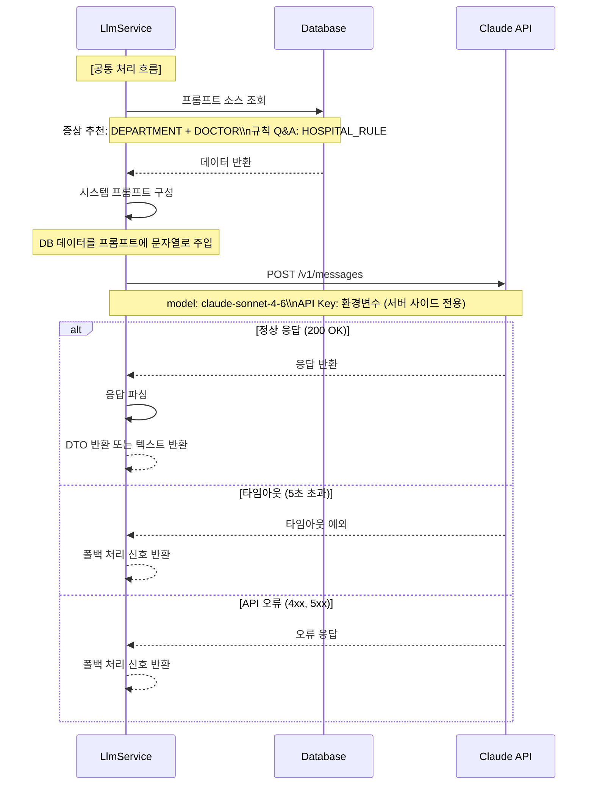

### 12.3 API Key 보안 원칙

```
브라우저 → Spring Boot 서버 → Claude API

규칙:
  ✅ API Key는 서버 환경변수로만 관리
  ✅ LlmService 내부에서만 API 호출
  ❌ 브라우저에서 Claude API 직접 호출 금지
  ❌ application.properties에 API Key 하드코딩 금지
  ❌ Git 저장소에 API Key 커밋 금지 (.gitignore 등록 필수)

설정:
  # application.properties
  claude.api.key=${CLAUDE_API_KEY}

  # 서버 환경변수 (Linux)
  export CLAUDE_API_KEY=sk-ant-xxxx
```

---

## 📌 설계 시 주요 고려 사항

**상태 전이 검증 위치**
상태 변경 API는 반드시 서버 측 Service 레이어에서 `ROLE` 및 현재 상태를 검증한 후 처리한다. 화면의 버튼 표시 여부만으로 권한을 대체하지 않는다.

**중복 예약 방지 이중 방어**
Service 레이어에서 사전 조회로 명확한 오류 메시지를 반환하고, DB UNIQUE 제약 `(doctor_id, reservation_date, time_slot)`이 최후 방어선을 담당한다.

**LLM 폴백 처리 필수**
증상 추천 API 실패 시 사용자 예약 흐름이 끊기지 않도록 "직접 선택" 화면으로 자연스럽게 전환한다. 규칙 챗봇 실패 시 관리자 문의 안내를 표시한다.

**LLM 면책 고지 필수**
증상 추천 결과 화면에는 "AI 추천은 참고용이며 의학적 진단이 아닙니다" 문구를 반드시 표시한다. 이를 화면 렌더링 조건에 포함시켜 빠지지 않도록 한다.

**TreatmentRecord + Reservation 트랜잭션 묶음**
진료 완료 처리 시 `TreatmentRecord` 저장과 `Reservation.status = COMPLETED` 변경은 반드시 `@Transactional` 내에서 처리한다.

---

*본 문서는 프로젝트 계획서 v4.1 및 ERD v2.0을 기반으로 작성되었습니다.변경 발생 시 GitHub Wiki에서 버전 이력을 관리합니다.*